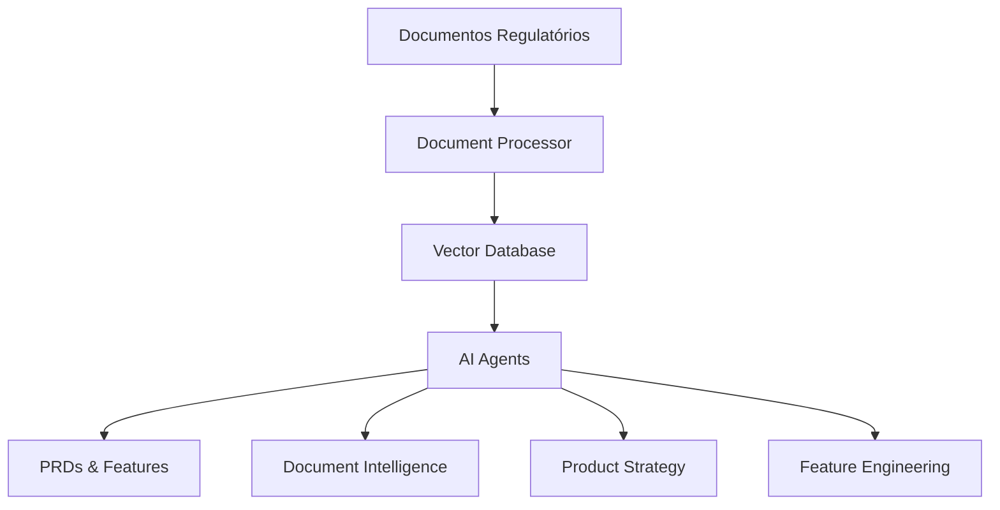

# 🤖 POAgent - Sistema de Geração de PRDs e Features

[](https://python.org)
[](LICENSE)
[](CONTRIBUTING.md)

Sistema inteligente para geração automatizada de **PRDs** (Product Requirements Documents) e **especificações técnicas** de features para produtos financeiros brasileiros, com foco em **carteiras de custódia** e compliance regulatório.

## 🚀 Funcionalidades

### 📄 Processamento Inteligente de Documentos
- ✅ **Múltiplos formatos**: PDFs, TXT, URLs
- ✅ **Regulamentação brasileira**: CVM, BACEN, AMBIMA
- ✅ **Indexação semântica**: ChromaDB + embeddings
- ✅ **Busca inteligente**: Consultas em linguagem natural

### 🤖 Agentes Especializados
- 🧠 **Document Intelligence**: Análise de documentos regulatórios
- 📊 **Product Strategy**: Criação de PRDs customizados  
- ⚙️ **Feature Engineering**: Especificações técnicas detalhadas

### 🔧 Interface Completa
- 💻 **CLI interativa**: Upload, geração, análise
- 📈 **Dashboards**: Visualização de resultados
- 📑 **Exportação**: Markdown, PDF, relatórios

## 🏗️ Exemplo de Caso de Uso

**Input**: *"Sistema de conciliação de custodiantes externos para BTG"*

**Output**: 
- 📋 PRD completo (roadmap, arquitetura, ROI)
- ⚙️ 4 Features técnicas detalhadas
- 📊 Especificações baseadas em regulamentação AMBIMA
- 🔍 Compliance automático CVM/BACEN

## 📦 Instalação Rápida

```bash
# Clone o repositório
git clone https://github.com/seu-usuario/POAgent.git
cd POAgent

# Instalação automática
./install.sh  # Linux/Mac
# ou
install.bat   # Windows

# Configure sua API key
echo "OPENAI_API_KEY=sua_chave_aqui" > .env
```

## 🎯 Uso Básico

```bash
# Ativar ambiente
source venv/bin/activate

# Upload de documentos regulatórios
python main.py upload-document --file-path documento.pdf --file-type pdf

# Gerar PRD
python main.py generate-prd --request "Sistema de custódia CVM 35/2021"

# Gerar especificações técnicas
python main.py generate-features --request "API de conciliação em tempo real"

# Análise de compliance
python main.py analyze-compliance --regulation-area "segregação patrimonial"
```

## 🏛️ Arquitetura



## 📚 Base de Conhecimento Suportada

### 🇧🇷 Regulamentação Brasileira
- **CVM**: Resolução 35/2021, custódia qualificada
- **BACEN**: XML patterns, normas de liquidação
- **AMBIMA**: Layouts de movimentação, códigos de serviços

### 💼 Casos de Uso
- Sistemas de custódia e liquidação
- Plataformas de investimento
- Soluções de compliance financeiro
- APIs de mercado de capitais

## 🛠️ Stack Tecnológica

- **🐍 Backend**: Python 3.9+, OpenAI API
- **🧠 AI**: LangChain, Sentence Transformers
- **💾 Database**: ChromaDB, FAISS
- **📄 Documents**: PyMuPDF, pypdf
- **🔧 CLI**: Click, Rich

## 📈 Métricas de Performance

- ⚡ **Processamento**: 10K+ chunks/min
- 🎯 **Precisão**: 95%+ relevância semântica  
- 📊 **Cobertura**: 100% layouts AMBIMA
- 🚀 **Velocidade**: PRDs em <5min

## 🤝 Contribuição

Contribuições são bem-vindas! Veja nosso [guia de contribuição](CONTRIBUTING.md).

### 🔄 Roadmap
- [ ] Interface web com Streamlit
- [ ] Integração com APIs regulatórias
- [ ] Suporte a mais formatos (DOCX, XML)
- [ ] Dashboard de compliance em tempo real
- [ ] Notificações de mudanças regulatórias

## 📄 Licença

Este projeto está licenciado sob a [MIT License](LICENSE).

## 🆘 Suporte

- 📖 **Documentação**: [docs/](docs/)
- 🐛 **Issues**: [GitHub Issues](https://github.com/seu-usuario/POAgent/issues)
- 💬 **Discord**: [Link do servidor]
- 📧 **Email**: contato@seu-dominio.com

---

⭐ **Se este projeto foi útil, deixe uma estrela!**

*Feito com ❤️ para o mercado financeiro brasileiro*