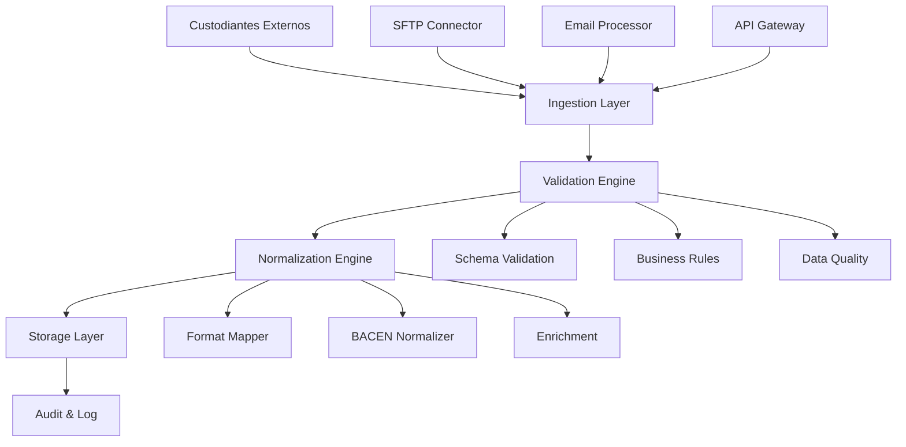
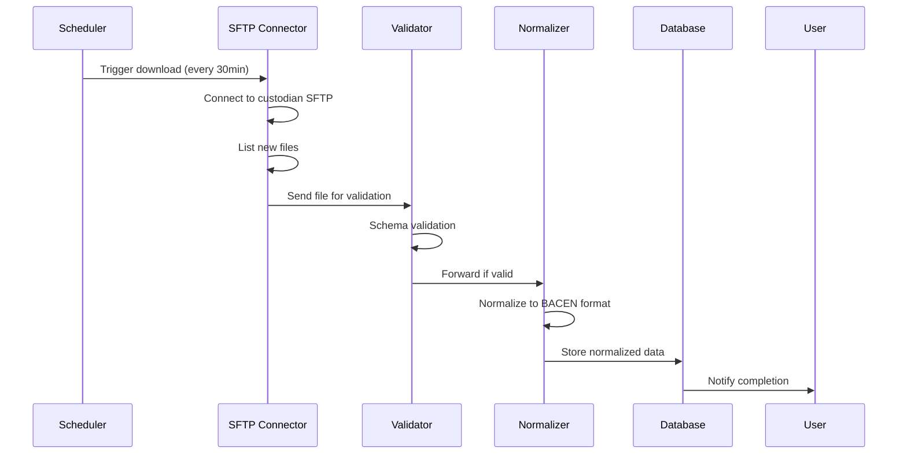
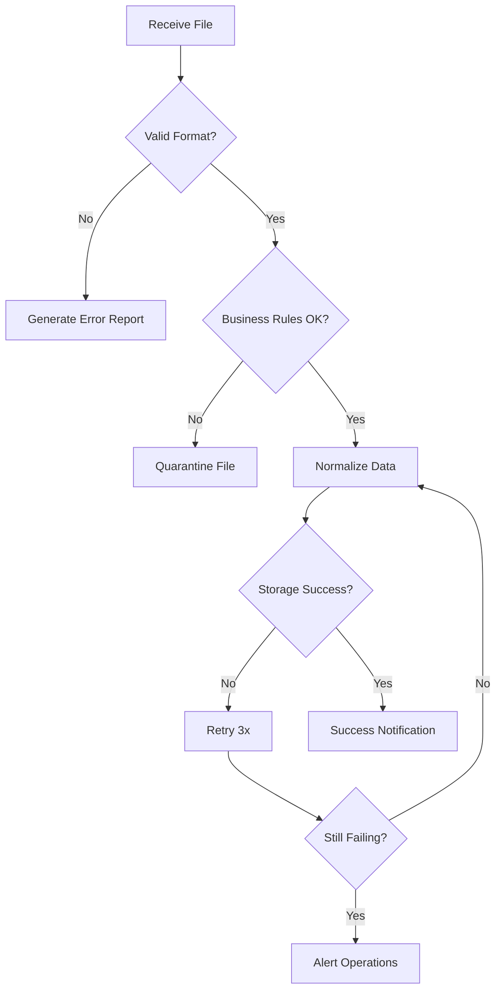

# Feature Specification - Módulo de Integração com Custodiantes Externos

**Projeto**: Sistema de Conciliação BTG  
**Feature**: F001 - Módulo de Integração Multi-Custodiante  
**Data**: 25/07/2025  
**Baseado em**: Documentos AMBIMA + Requisitos BTG

---

## 1. FEATURE OVERVIEW

### 1.1 Descrição Funcional
Sistema de integração automatizada para recepção, validação e normalização de dados de carteiras de fundos de investimento provenientes de múltiplos custodiantes externos (Itaú, Bradesco, Santander e outros), suportando múltiplos canais de comunicação (XML, e-mail, SFTP) e garantindo conformidade com padrões regulatórios AMBIMA e BACEN.

### 1.2 Business Value
- **Automatização**: Redução de 95% do trabalho manual de importação
- **Padronização**: Unificação de formatos diversos em padrão único BACEN
- **Confiabilidade**: Validação automática e detecção de inconsistências
- **Escalabilidade**: Suporte a novos custodiantes sem retrabalho
- **Compliance**: Aderência total aos layouts AMBIMA de movimentação

### 1.3 Success Criteria
- ✅ **Performance**: Processamento de 10.000+ transações/hora
- ✅ **Disponibilidade**: 99.9% de uptime nos conectores
- ✅ **Integridade**: 100% dos dados validados e auditados
- ✅ **Cobertura**: Suporte a 10+ custodiantes principais
- ✅ **Latência**: Dados disponíveis em <5min após recepção

### 1.4 Dependencies
- **Credenciais**: Certificados e chaves para cada custodiante
- **Conectividade**: Links seguros SFTP/VPN configurados
- **Ambiente**: Base de dados transacional disponível
- **Regulamentação**: Layouts AMBIMA atualizados

---

## 2. ESPECIFICAÇÃO TÉCNICA

### 2.1 Arquitetura de Componentes



### 2.2 Data Models e Schemas

#### 2.2.1 Schema de Entrada (Raw Data)
```json
{
  "source": {
    "custodian": "string", // ITAU, BRADESCO, SANTANDER
    "channel": "string",   // SFTP, EMAIL, API
    "timestamp": "datetime",
    "file_id": "string",
    "checksum": "string"
  },
  "content": {
    "format": "string",    // XML, CSV, TXT
    "encoding": "string",  // UTF-8, ISO-8859-1
    "data": "base64"       // Conteúdo do arquivo
  }
}
```

#### 2.2.2 Schema Normalizado (BACEN Pattern)
```xml
<MovimentacaoFundos xmlns="http://www.bacen.gov.br/schema/custodia">
  <Cabecalho>
    <CodCustodiante>12345678</CodCustodiante>
    <DataMovimento>2025-07-25</DataMovimento>
    <TipoArquivo>POSICAO</TipoArquivo>
  </Cabecalho>
  <Fundos>
    <Fundo>
      <CNPJ>12.345.678/0001-90</CNPJ>
      <Posicoes>
        <Posicao>
          <CodigoISIN>BRXYZABCDEF1</CodigoISIN>
          <Quantidade>1000000.00</Quantidade>
          <ValorUnitario>1.234567</ValorUnitario>
          <ValorTotal>1234567.00</ValorTotal>
        </Posicao>
      </Posicoes>
    </Fundo>
  </Fundos>
</MovimentacaoFundos>
```

### 2.3 API Endpoints e Contracts

#### 2.3.1 Endpoint de Status
```http
GET /api/v1/integration/status
Authorization: Bearer {token}

Response 200:
{
  "custodians": [
    {
      "name": "ITAU",
      "status": "CONNECTED",
      "last_sync": "2025-07-25T10:30:00Z",
      "pending_files": 3,
      "error_count": 0
    }
  ]
}
```

#### 2.3.2 Endpoint de Processamento Manual
```http
POST /api/v1/integration/process
Authorization: Bearer {token}
Content-Type: multipart/form-data

Body:
- file: arquivo.xml
- custodian: ITAU
- type: POSICAO

Response 202:
{
  "job_id": "uuid",
  "status": "PROCESSING",
  "estimated_completion": "2025-07-25T10:35:00Z"
}
```

### 2.4 Security Considerations

#### 2.4.1 Autenticação e Autorização
- **Custodiantes**: Certificados X.509 mútua autenticação
- **APIs internas**: OAuth 2.0 + JWT com escopo específico
- **SFTP**: SSH keys + IP whitelisting
- **E-mail**: S/MIME para assinatura digital

#### 2.4.2 Criptografia
- **Em trânsito**: TLS 1.3 obrigatório
- **Em repouso**: AES-256 para dados sensíveis
- **Chaves**: Azure Key Vault ou HSM
- **Logs**: Hash SHA-256 para integridade

#### 2.4.3 Auditoria
```sql
CREATE TABLE AuditLog (
    Id BIGINT IDENTITY PRIMARY KEY,
    Timestamp DATETIME2 NOT NULL,
    Source NVARCHAR(50) NOT NULL,
    Operation NVARCHAR(100) NOT NULL,
    UserId NVARCHAR(100),
    Details NVARCHAR(MAX),
    Hash NVARCHAR(64) NOT NULL -- SHA-256
);
```

### 2.5 Performance Requirements
- **Throughput**: 10.000 transações/hora por custodiante
- **Concorrência**: 50 arquivos simultâneos
- **Latência**: <30s para validação completa
- **Storage**: Particionamento por mês, retenção 7 anos
- **Memory**: <2GB heap per worker process

---

## 3. USER EXPERIENCE

### 3.1 User Flows Detalhados

#### 3.1.1 Fluxo Automático SFTP


#### 3.1.2 Fluxo de Erro e Retry


### 3.2 Interface Mockups Conceituais

#### 3.2.1 Dashboard de Monitoramento
```
┌─────────────────────────────────────────────────────────────┐
│ INTEGRAÇÃO CUSTODIANTES - Dashboard                         │
├─────────────────────────────────────────────────────────────┤
│ Status Conectores:                                          │
│ ● ITAU    [●●●●●] Connected    Last: 10:30  Files: 3       │
│ ● BRADESCO [●●●●○] Warning     Last: 09:45  Files: 0       │  
│ ● SANTANDER [●●○○○] Error      Last: 08:20  Error: Timeout │
│                                                             │
│ Arquivos Processados Hoje:                  [156 ✓] [3 ✗] │
│ ┌─────────────────────────────────────────────────────────┐ │
│ │ Últimos Processamentos:                                 │ │
│ │ 10:32 ITAU_POSICAO_20250725.xml      ✓ 2.341 registros │ │
│ │ 10:28 BRAD_MOVIM_20250725.xml        ✓ 1.205 registros │ │  
│ │ 10:15 SANT_POSICAO_20250725.xml      ✗ Erro validação  │ │
│ └─────────────────────────────────────────────────────────┘ │
└─────────────────────────────────────────────────────────────┘
```

### 3.3 Error Handling Scenarios

#### 3.3.1 Matriz de Erros
| Tipo Erro | Ação Automática | Notificação | Retry |
|------------|-----------------|-------------|-------|
| Conectividade | Retry 3x (5min) | Ops após 3 falhas | Sim |
| Formato inválido | Quarentena | Imediata + Daily report | Não |
| Schema violation | Log + Skip record | Daily report | Não |
| Business rule | Quarentena parcial | Imediata | Não |
| Storage failure | Retry infinito | Ops imediato | Sim |

#### 3.3.2 Códigos de Erro Padronizados
```json
{
  "error_codes": {
    "INT001": "Conexão SFTP falhou",
    "INT002": "Arquivo não encontrado",  
    "INT003": "Formato XML inválido",
    "INT004": "Schema validation failed",
    "INT005": "Business rule violation",
    "INT006": "Storage unavailable",
    "INT007": "Checksum mismatch",
    "INT008": "Timeout during processing"
  }
}
```

### 3.4 Accessibility Requirements
- **API**: OpenAPI 3.0 spec completa
- **Logs**: Structured logging (JSON format)
- **Monitoring**: Prometheus metrics
- **Documentation**: Swagger UI + Postman collection
- **CLI**: Command-line tools para ops

---

## 4. INTEGRATION REQUIREMENTS

### 4.1 External System Integrations

#### 4.1.1 Custodiante Itaú
```yaml
integration:
  name: "ITAU_CUSTODIA"
  type: "SFTP"
  connection:
    host: "sftp.itau.com.br"
    port: 22
    auth: "certificate"
    schedule: "*/30 * * * *"  # Every 30 minutes
  file_patterns:
    - "POSICAO_*_*.xml"
    - "MOVIM_*_*.xml"
  validation:
    schema: "itau_v2.xsd"
    encoding: "UTF-8"
  mapping:
    fields:
      - source: "CodigoFundo"
        target: "FundCode"
        transform: "padLeft(8, '0')"
```

#### 4.1.2 Custodiante Bradesco
```yaml
integration:
  name: "BRADESCO_CUSTODIA"
  type: "EMAIL"
  connection:
    server: "imap.bradesco.com.br"
    port: 993
    auth: "oauth2"
    poll_interval: 300  # 5 minutes
  email_config:
    from_filter: "custodia@bradesco.com.br"
    subject_pattern: "Posicao|Movimentacao"
    attachment_types: [".xml", ".txt"]
  validation:
    schema: "bradesco_v1.xsd"
    encoding: "ISO-8859-1"
```

### 4.2 Message Formats e Protocols

#### 4.2.1 Internal Message Queue
```json
{
  "message_type": "FILE_RECEIVED",
  "timestamp": "2025-07-25T14:30:00Z",
  "payload": {
    "source": "ITAU",
    "file_id": "abc123",
    "file_path": "/incoming/itau/posicao_20250725.xml",
    "size_bytes": 524288,
    "checksum": "sha256:abc123def456"
  },
  "routing_key": "integration.file.received",
  "priority": 1
}
```

#### 4.2.2 Event Sourcing Pattern
```sql
CREATE TABLE IntegrationEvents (
    Id BIGINT IDENTITY PRIMARY KEY,
    AggregateId UNIQUEIDENTIFIER NOT NULL,
    EventType NVARCHAR(100) NOT NULL,
    EventData NVARCHAR(MAX) NOT NULL,
    EventVersion INT NOT NULL,
    Timestamp DATETIME2 NOT NULL,
    UserId NVARCHAR(100)
);
```

### 4.3 Authentication e Authorization

#### 4.3.1 OAuth 2.0 Scopes
```yaml
scopes:
  - "integration:read"     # Consultar status
  - "integration:write"    # Processar arquivos  
  - "integration:admin"    # Configurar conectores
  - "integration:monitor"  # Acessar métricas
```

#### 4.3.2 Rate Limiting
```yaml
rate_limits:
  by_client:
    default: "1000/hour"
    premium: "10000/hour"
  by_endpoint:
    "/api/v1/integration/process": "100/hour"
    "/api/v1/integration/status": "unlimited"
```

### 4.4 Monitoring e Observability

#### 4.4.1 Métricas Prometheus
```prometheus
# Arquivos processados por custodiante
integration_files_processed_total{custodian="itau",status="success"} 1234

# Latência de processamento
integration_processing_duration_seconds{operation="normalize"} 2.34

# Erros por tipo
integration_errors_total{type="schema_validation",custodian="bradesco"} 5

# Saúde dos conectores
integration_connector_up{custodian="santander"} 0
```

#### 4.4.2 Logs Estruturados
```json
{
  "timestamp": "2025-07-25T14:30:00Z",
  "level": "INFO",
  "logger": "IntegrationService",
  "message": "File processed successfully",
  "context": {
    "custodian": "ITAU",
    "file_id": "abc123",
    "records_processed": 2341,
    "duration_ms": 2340,
    "correlation_id": "req-xyz789"
  }
}
```

---

## 5. COMPLIANCE & SECURITY

### 5.1 Regulatory Compliance Mappings

#### 5.1.1 AMBIMA Layout Compliance
Baseado nos documentos indexados AMBIMA:
- **Layout Movimentação Fundos**: Mapeamento 1:1 dos campos obrigatórios
- **Código de Serviços Qualificados**: Validação de serviços permitidos
- **Manual Layout Posição**: Estrutura de dados de posições

```xml
<!-- Mapeamento AMBIMA para BACEN -->
<FieldMapping>
  <AMBIMA field="CodFundo" bacen="CodigoFundo" required="true"/>
  <AMBIMA field="DataPos" bacen="DataPosicao" format="YYYY-MM-DD"/>
  <AMBIMA field="VlrPatr" bacen="ValorPatrimonio" precision="2"/>
</FieldMapping>
```

#### 5.1.2 CVM Compliance (Resolução 35/2021)
- **Segregação**: Dados por instituição separados fisicamente
- **Auditoria**: Trilha completa de modificações
- **Backup**: Retenção mínima 5 anos
- **Acesso**: Controle por perfil e função

### 5.2 Security Controls Necessários

#### 5.2.1 Controles de Acesso
```yaml
access_controls:
  authentication:
    - certificate_based: "custodiantes externos"
    - oauth2_jwt: "usuarios internos"
    - api_key: "sistemas batch"
  
  authorization:
    rbac:
      roles:
        - integration_admin
        - integration_operator  
        - integration_viewer
      permissions:
        - read_files
        - process_files
        - configure_connectors
```

#### 5.2.2 Data Classification
| Tipo Dado | Classificação | Controles |
|-----------|---------------|-----------|
| Posições | Confidencial | Criptografia + Acesso restrito |
| Movimentações | Confidencial | Auditoria + Retenção 7 anos |
| Configurações | Interno | Versionamento + Aprovação |
| Logs | Interno | Anonimização + Retenção 2 anos |

### 5.3 Audit Trail Requirements

#### 5.3.1 Eventos Auditáveis
```sql
-- Tabela de auditoria detalhada
CREATE TABLE FileProcessingAudit (
    Id BIGINT IDENTITY PRIMARY KEY,
    FileId UNIQUEIDENTIFIER NOT NULL,
    Custodian NVARCHAR(50) NOT NULL,
    FileName NVARCHAR(255) NOT NULL,
    ProcessingStatus NVARCHAR(50) NOT NULL,
    RecordsProcessed INT NULL,
    ErrorCount INT NULL,
    StartTime DATETIME2 NOT NULL,
    EndTime DATETIME2 NULL,
    ProcessedBy NVARCHAR(100) NOT NULL,
    Checksum NVARCHAR(64) NOT NULL,
    SourcePath NVARCHAR(500) NULL
);
```

### 5.4 Risk Mitigation Strategies

#### 5.4.1 Matriz de Riscos
| Risco | Probabilidade | Impacto | Mitigação |
|-------|---------------|---------|-----------|
| Dados corrompidos | Média | Alto | Checksum + Backup |
| Acesso não autorizado | Baixa | Crítico | Certificates + Logs |
| Falha conectividade | Alta | Médio | Retry + Alertas |
| Schema changes | Média | Alto | Versioning + Tests |

---

## 6. TESTING STRATEGY

### 6.1 Unit Testing Requirements

#### 6.1.1 Coverage Targets
- **Code Coverage**: Mínimo 85%
- **Branch Coverage**: Mínimo 80%  
- **Critical Paths**: 100% (validação, normalização)

#### 6.1.2 Test Categories
```csharp
[TestClass]
public class XmlValidatorTests
{
    [TestMethod]
    public void ValidateSchema_ValidXml_ReturnsTrue()
    {
        // Arrange
        var validator = new XmlValidator("itau_schema.xsd");
        var validXml = LoadTestFile("valid_itau.xml");
        
        // Act
        var result = validator.Validate(validXml);
        
        // Assert
        Assert.IsTrue(result.IsValid);
    }
    
    [TestMethod]
    public void ValidateSchema_MissingMandatoryField_ReturnsFalse()
    {
        // Test para campos obrigatórios
    }
}
```

### 6.2 Integration Testing Scenarios

#### 6.2.1 End-to-End Test Cases
```yaml
test_scenarios:
  - name: "ITAU_SFTP_Happy_Path"
    description: "Processamento completo arquivo ITAU via SFTP"
    steps:
      - connect_sftp: "mock_itau_server"
      - download_file: "test_posicao.xml"
      - validate_schema: "expect_success"
      - normalize_data: "expect_2341_records"
      - store_database: "expect_success"
    
  - name: "BRADESCO_EMAIL_Error_Recovery"  
    description: "Recuperação de erro email Bradesco"
    steps:
      - receive_email: "invalid_attachment"
      - validate_schema: "expect_failure"
      - quarantine_file: "expect_success"
      - send_notification: "expect_alert"
```

### 6.3 Performance Testing Criteria

#### 6.3.1 Load Testing
```yaml
performance_tests:
  throughput:
    target: "10000 transactions/hour"
    test_duration: "1 hour"
    concurrent_files: 50
    
  stress:
    target: "20000 transactions/hour"  
    test_duration: "30 minutes"
    failure_threshold: "5%"
    
  volume:
    file_sizes: ["1MB", "10MB", "100MB"]
    record_counts: [1000, 10000, 100000]
```

### 6.4 Security Testing Protocols

#### 6.4.1 Penetration Testing
- **Authentication bypass**: Tentativas de acesso sem credenciais
- **SQL Injection**: Testes em campos de entrada
- **XSS**: Validação de saídas HTML/JSON
- **OWASP Top 10**: Cobertura completa

#### 6.4.2 Compliance Testing
```yaml
compliance_tests:
  lgpd:
    - test_data_anonymization
    - test_consent_management
    - test_data_deletion
    
  bacen:
    - test_xml_schema_compliance
    - test_audit_trail_completeness
    - test_data_retention_policies
```

---

## 7. IMPLEMENTATION GUIDELINES

### 7.1 Development Standards

#### 7.1.1 Code Structure
```
src/
├── Integration/
│   ├── Connectors/
│   │   ├── ItauConnector.cs
│   │   ├── BradescoConnector.cs
│   │   └── SantanderConnector.cs
│   ├── Validators/
│   │   ├── XmlValidator.cs
│   │   └── BusinessRuleValidator.cs
│   ├── Normalizers/
│   │   ├── BacenNormalizer.cs
│   │   └── FieldMapper.cs
│   └── Storage/
│       ├── DatabaseRepository.cs
│       └── AuditLogger.cs
```

#### 7.1.2 Configuration Management
```json
{
  "Integration": {
    "Custodians": {
      "Itau": {
        "ConnectionString": "sftp://...",
        "Certificate": "vault://certificates/itau",
        "Schedule": "0 */30 * * * *",
        "RetryPolicy": {
          "MaxAttempts": 3,
          "BackoffSeconds": [30, 60, 120]
        }
      }
    },
    "Validation": {
      "EnableSchemaValidation": true,
      "EnableBusinessRules": true,
      "StrictMode": false
    }
  }
}
```

### 7.2 Deployment Architecture

#### 7.2.1 Container Strategy
```dockerfile
FROM mcr.microsoft.com/dotnet/aspnet:6.0
WORKDIR /app
COPY bin/Release/net6.0/publish .
EXPOSE 80 443
ENTRYPOINT ["dotnet", "IntegrationService.dll"]
```

#### 7.2.2 Kubernetes Manifests
```yaml
apiVersion: apps/v1
kind: Deployment
metadata:
  name: integration-service
spec:
  replicas: 3
  selector:
    matchLabels:
      app: integration-service
  template:
    spec:
      containers:
      - name: integration-service
        image: btg/integration-service:v1.0
        resources:
          requests:
            memory: "512Mi"
            cpu: "250m"
          limits:
            memory: "2Gi" 
            cpu: "1000m"
```

### 7.3 Data Migration Strategy

#### 7.3.1 Schema Evolution
```sql
-- V1.0.0 - Initial schema
CREATE TABLE ProcessedFiles (
    Id BIGINT IDENTITY PRIMARY KEY,
    FileName NVARCHAR(255) NOT NULL,
    Custodian NVARCHAR(50) NOT NULL,
    ProcessedAt DATETIME2 NOT NULL
);

-- V1.1.0 - Add checksum field  
ALTER TABLE ProcessedFiles 
ADD Checksum NVARCHAR(64) NULL;
```

### 7.4 Operational Procedures

#### 7.4.1 Runbook
```markdown
## Procedimento: Falha na Integração ITAU

### Sintomas:
- Dashboard mostra status "ERROR" para ITAU
- Logs mostram "Connection timeout"

### Diagnóstico:
1. Verificar conectividade: `ping sftp.itau.com.br`
2. Testar credenciais: `sftp -i cert.pem user@sftp.itau.com.br`
3. Verificar logs: `kubectl logs -f integration-service`

### Resolução:
1. Se timeout: Aumentar timeout em config
2. Se credencial: Renovar certificado
3. Se indisponível: Ativar modo retry
```

---

## 8. ACCEPTANCE CRITERIA

### 8.1 Functional Requirements
- [ ] **FR001**: Sistema conecta com 3+ custodiantes via SFTP/Email
- [ ] **FR002**: Processa arquivos XML em formato AMBIMA/BACEN
- [ ] **FR003**: Valida 100% dos arquivos recebidos
- [ ] **FR004**: Normaliza dados para padrão único BTG
- [ ] **FR005**: Armazena dados com audit trail completo
- [ ] **FR006**: Detecta e reporta 100% das inconsistências
- [ ] **FR007**: Suporta processamento de 10K+ transações/hora

### 8.2 Non-Functional Requirements  
- [ ] **NFR001**: Disponibilidade 99.9% (máx 8.76h downtime/ano)
- [ ] **NFR002**: Latência <30s para validação de arquivo
- [ ] **NFR003**: Throughput 10.000 transações/hora por custodiante
- [ ] **NFR004**: Retenção de dados por 7 anos
- [ ] **NFR005**: Logs auditáveis e imutáveis
- [ ] **NFR006**: Criptografia TLS 1.3 obrigatória
- [ ] **NFR007**: Backup automático diário

### 8.3 Definition of Done
- [ ] **Código**: Unit tests com 85%+ coverage
- [ ] **Integração**: E2E tests passando em staging
- [ ] **Performance**: Load tests validados
- [ ] **Segurança**: Pen tests executados
- [ ] **Documentação**: APIs documentadas no Swagger
- [ ] **Compliance**: Auditoria AMBIMA aprovada
- [ ] **Operação**: Runbooks e alertas configurados

---

## 9. ROADMAP DE IMPLEMENTAÇÃO

### 9.1 Sprint 1-2 (Semanas 1-4) - Fundação
- [ ] Setup da infraestrutura (K8s, DB, Message Queue)
- [ ] Implementação do conector ITAU (SFTP)
- [ ] Schema de dados básico
- [ ] Validação XML básica

### 9.2 Sprint 3-4 (Semanas 5-8) - Expansão  
- [ ] Conectores Bradesco (Email) e Santander
- [ ] Engine de normalização BACEN
- [ ] API REST básica
- [ ] Dashboard de monitoramento

### 9.3 Sprint 5-6 (Semanas 9-12) - Produção
- [ ] Performance optimization
- [ ] Security hardening
- [ ] Monitoring e alertas
- [ ] Documentação e treinamento

### 9.4 Sprint 7-8 (Semanas 13-16) - Estabilização
- [ ] Bug fixes e melhorias
- [ ] Testes de carga completos
- [ ] Go-live produção
- [ ] Support e manutenção

---

**Feature Owner**: Arquiteto de Soluções BTG  
**Tech Lead**: Development Team Lead  
**Stakeholders**: Risk Management, Operations, Compliance  
**Baseado em**: Layouts AMBIMA + Regulamentação BACEN + Requisitos BTG