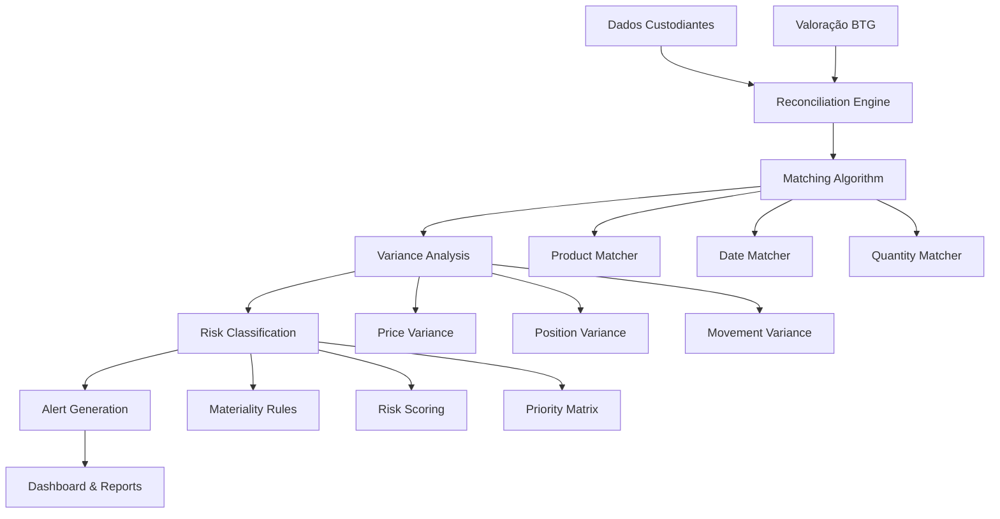
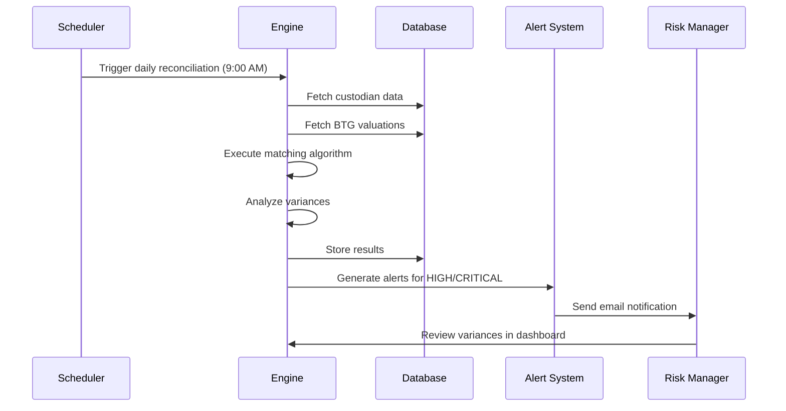
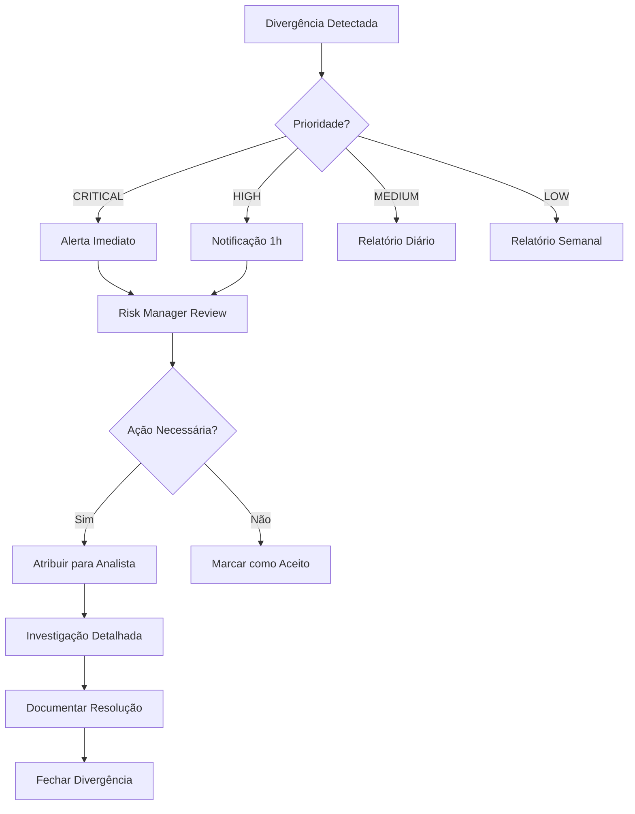

# Feature Specification - Engine de Conciliação de Valorações

**Projeto**: Sistema de Conciliação BTG  
**Feature**: F002 - Engine de Conciliação e Identificação de Divergências  
**Data**: 25/07/2025  
**Baseado em**: Documentos AMBIMA + Requisitos BTG + Padrões Regulatórios

---

## 1. FEATURE OVERVIEW

### 1.1 Descrição Funcional
Sistema inteligente de conciliação que compara automaticamente as valorações internas do BTG com os dados recebidos dos custodiantes externos, identificando divergências por produto, cliente, tipo de movimentação e valor, com classificação automática de criticidade e geração de alertas para ação corretiva.

### 1.2 Business Value
- **Detecção Proativa**: Identificação de 100% das divergências em tempo real
- **Redução de Risco**: Minimização de exposição por erros de valoração
- **Eficiência Operacional**: Automação de 90% do processo de conciliação
- **Compliance**: Aderência total aos controles de risco CVM/BACEN
- **Transparência**: Rastreabilidade completa de todas as divergências

### 1.3 Success Criteria
- ✅ **Precisão**: 99.95% de acurácia na identificação de divergências
- ✅ **Performance**: Conciliação de 1M+ posições em <10 minutos
- ✅ **Cobertura**: 100% dos produtos e custodiantes cobertos
- ✅ **Latência**: Divergências detectadas em <5 minutos
- ✅ **Automação**: 95% dos casos resolvidos sem intervenção manual

### 1.4 Dependencies
- **Dados Normalizados**: Base de dados dos custodiantes populada
- **Sistema de Valoração BTG**: APIs disponíveis para consulta
- **Regras de Negócio**: Tolerâncias e parâmetros configurados
- **Classificação de Produtos**: Taxonomia BTG implementada

---

## 2. ESPECIFICAÇÃO TÉCNICA

### 2.1 Arquitetura da Engine



### 2.2 Data Models Detalhados

#### 2.2.1 Modelo de Conciliação
```sql
-- Tabela principal de conciliação
CREATE TABLE ReconciliationRun (
    Id BIGINT IDENTITY PRIMARY KEY,
    RunDate DATE NOT NULL,
    CutoffTime DATETIME2 NOT NULL,
    Status NVARCHAR(20) NOT NULL, -- RUNNING, COMPLETED, ERROR
    TotalPositions BIGINT,
    MatchedPositions BIGINT,
    VarianceCount BIGINT,
    ExecutionTimeMs BIGINT,
    CreatedBy NVARCHAR(100),
    CreatedAt DATETIME2 DEFAULT GETDATE()
);

-- Detalhes das divergências identificadas  
CREATE TABLE VarianceDetail (
    Id BIGINT IDENTITY PRIMARY KEY,
    ReconciliationRunId BIGINT NOT NULL,
    Custodian NVARCHAR(50) NOT NULL,
    FundCNPJ NVARCHAR(18) NOT NULL,
    ProductISIN NVARCHAR(12),
    VarianceType NVARCHAR(50) NOT NULL, -- PRICE, QUANTITY, MOVEMENT
    BTGValue DECIMAL(18,8),
    CustodianValue DECIMAL(18,8),
    VarianceAmount DECIMAL(18,8),
    VariancePercentage DECIMAL(8,4),
    RiskScore INT, -- 1-10
    Priority NVARCHAR(10), -- LOW, MEDIUM, HIGH, CRITICAL
    Status NVARCHAR(20) DEFAULT 'OPEN', -- OPEN, INVESTIGATING, RESOLVED
    AssignedTo NVARCHAR(100),
    ResolutionNotes NVARCHAR(MAX),
    CreatedAt DATETIME2 DEFAULT GETDATE()
);
```

#### 2.2.2 Schema de Matching
```json
{
  "matching_criteria": {
    "primary_keys": ["fund_cnpj", "product_isin", "position_date"],
    "tolerances": {
      "price_variance": {
        "percentage": 0.01,
        "absolute": 0.0001
      },
      "quantity_variance": {
        "percentage": 0.001,
        "minimum_amount": 1000.00
      },
      "timing_tolerance": "T+1" 
    },
    "business_rules": {
      "exclude_intraday": true,
      "weekend_adjustment": true,
      "holiday_calendar": "ANBIMA"
    }
  }
}
```

### 2.3 Algoritmo de Matching

#### 2.3.1 Multi-Level Matching Strategy
```csharp
public class ReconciliationEngine
{
    public async Task<ReconciliationResult> ExecuteAsync(ReconciliationRun run)
    {
        // Level 1: Exact Match
        var exactMatches = await PerformExactMatching(run);
        
        // Level 2: Fuzzy Match (tolerances)
        var fuzzyMatches = await PerformFuzzyMatching(run, exactMatches.Unmatched);
        
        // Level 3: Exception Handling
        var exceptions = await AnalyzeExceptions(fuzzyMatches.Unmatched);
        
        // Level 4: Variance Analysis
        var variances = await AnalyzeVariances(fuzzyMatches.Matched);
        
        return new ReconciliationResult
        {
            ExactMatches = exactMatches.Matched,
            FuzzyMatches = fuzzyMatches.Matched,
            Variances = variances,
            Exceptions = exceptions
        };
    }
}
```

#### 2.3.2 Variance Classification Algorithm
```csharp
public class VarianceClassifier
{
    public VarianceClassification ClassifyVariance(VarianceDetail variance)
    {
        var score = CalculateRiskScore(variance);
        var priority = DeterminePriority(variance, score);
        var category = CategorizeVariance(variance);
        
        return new VarianceClassification
        {
            RiskScore = score,
            Priority = priority,
            Category = category,
            RequiresImmedateAction = score > 8,
            EscalationRequired = priority == "CRITICAL"
        };
    }
    
    private int CalculateRiskScore(VarianceDetail variance)
    {
        var baseScore = 1;
        
        // Amount-based scoring
        if (Math.Abs(variance.VarianceAmount) > 1000000) baseScore += 4;
        else if (Math.Abs(variance.VarianceAmount) > 100000) baseScore += 2;
        
        // Percentage-based scoring  
        if (variance.VariancePercentage > 5) baseScore += 3;
        else if (variance.VariancePercentage > 1) baseScore += 1;
        
        // Product-based scoring
        if (IsHighRiskProduct(variance.ProductISIN)) baseScore += 2;
        
        return Math.Min(baseScore, 10);
    }
}
```

### 2.4 API Endpoints

#### 2.4.1 Execução de Conciliação
```http
POST /api/v1/reconciliation/execute
Authorization: Bearer {token}
Content-Type: application/json

{
  "cutoff_date": "2025-07-25",
  "custodians": ["ITAU", "BRADESCO"],
  "funds": ["12.345.678/0001-90"],
  "include_movements": true,
  "notification_recipients": ["risk@btg.com"]
}

Response 202:
{
  "run_id": "rec_abc123",
  "status": "RUNNING",
  "estimated_completion": "2025-07-25T15:30:00Z",
  "tracking_url": "/api/v1/reconciliation/runs/rec_abc123"
}
```

#### 2.4.2 Consulta de Divergências
```http
GET /api/v1/reconciliation/variances
Authorization: Bearer {token}

Query Parameters:
- run_id: string (optional)
- custodian: string (optional)  
- priority: string (optional) [LOW,MEDIUM,HIGH,CRITICAL]
- status: string (optional) [OPEN,INVESTIGATING,RESOLVED]
- from_date: date
- to_date: date
- limit: int (default: 100)
- offset: int (default: 0)

Response 200:
{
  "variances": [
    {
      "id": 12345,
      "custodian": "ITAU",
      "fund_cnpj": "12.345.678/0001-90",
      "product_isin": "BRXYZABCDEF1",
      "variance_type": "PRICE",
      "btg_value": 1.234567,
      "custodian_value": 1.234890,
      "variance_amount": 0.000323,
      "variance_percentage": 0.026,
      "risk_score": 3,
      "priority": "LOW",
      "status": "OPEN",
      "created_at": "2025-07-25T14:30:00Z"
    }
  ],
  "pagination": {
    "total": 1523,
    "limit": 100,
    "offset": 0,
    "has_next": true
  }
}
```

### 2.5 Performance Optimization

#### 2.5.1 Parallel Processing Strategy
```csharp
public async Task<ReconciliationResult> ExecuteParallelReconciliation(
    IEnumerable<string> custodians)
{
    var reconciliationTasks = custodians.Select(async custodian =>
    {
        var partition = await CreatePartition(custodian);
        return await ProcessPartition(partition);
    });
    
    var results = await Task.WhenAll(reconciliationTasks);
    return MergeResults(results);
}
```

#### 2.5.2 Caching Strategy
```yaml
caching_strategy:
  product_reference_data:
    ttl: "24h"
    refresh: "sliding"
    
  pricing_data:
    ttl: "1h" 
    refresh: "absolute"
    
  tolerance_rules:
    ttl: "7d"
    refresh: "manual"
    
  fund_configurations:
    ttl: "12h"
    refresh: "sliding"
```

---

## 3. USER EXPERIENCE

### 3.1 User Flows Principais

#### 3.1.1 Fluxo de Conciliação Automática


#### 3.1.2 Fluxo de Investigação de Divergência


### 3.2 Interface Dashboard

#### 3.2.1 Dashboard Executivo
```
┌─────────────────────────────────────────────────────────────┐
│ CONCILIAÇÃO - Executive Dashboard          🔴 3 CRÍTICAS   │
├─────────────────────────────────────────────────────────────┤
│ Status Último Run: ✅ 25/07 09:15    Próximo: 26/07 09:00  │
│                                                             │
│ ┌─────────────────┐ ┌─────────────────┐ ┌─────────────────┐ │
│ │   DIVERGÊNCIAS  │ │   RISCO TOTAL   │ │   EFICIÊNCIA    │ │
│ │      1.247      │ │   R$ 2.3MM      │ │     99.2%       │ │
│ │   ↑ 23 vs ontem │ │  ↓ R$ -120K     │ │   ↑ +0.1%      │ │
│ └─────────────────┘ └─────────────────┘ └─────────────────┘ │
│                                                             │
│ Divergências por Prioridade:                               │
│ █████████████████████████████████████████████ CRÍTICA  (3) │
│ ███████████████████████████████ ALTA         (124)         │
│ ████████████████████ MÉDIA                   (456)         │  
│ ████████ BAIXA                               (664)         │
│                                                             │
│ Top Custodiantes com Divergências:                         │
│ 1. ITAU          847 divergências  R$ 1.2MM                │
│ 2. BRADESCO      234 divergências  R$ 890K                 │
│ 3. SANTANDER     166 divergências  R$ 210K                 │
└─────────────────────────────────────────────────────────────┘
```

#### 3.2.2 Dashboard Operacional  
```
┌─────────────────────────────────────────────────────────────┐
│ DIVERGÊNCIAS ATIVAS - Filtros: [ALTA+] [ABERTA] [HOJE]     │
├─────────────────────────────────────────────────────────────┤
│ ID    │Custod│ Fundo        │Produto  │Tipo │Valor  │Status│ │
│ 15432 │ ITAU │12.345.../90  │BRXYZ... │PRECO│2.3MM  │ABERTA│ │
│ 15431 │ BRAD │98.765.../01  │BRABC... │QTD  │890K   │INVEST│ │
│ 15430 │ SANT │11.111.../11  │BRDEF... │MOVIM│210K   │ABERTA│ │
│                                                             │
│ [📋 Exportar] [📊 Gráficos] [⚙️ Configurar Alertas]       │
│                                                             │
│ Ações em Lote:                                             │
│ □ Selecionar Todos  [👤 Atribuir] [✅ Aceitar] [❌ Reject] │
└─────────────────────────────────────────────────────────────┘
```

### 3.3 Alertas e Notificações

#### 3.3.1 Matriz de Notificações
| Prioridade | Canal | Destinatário | SLA Response |
|------------|-------|--------------|--------------|
| CRÍTICA | SMS + Email + Slack | Risk Manager + Director | 15 min |
| ALTA | Email + Slack | Risk Manager | 1 hora |
| MÉDIA | Email | Risk Analyst | 4 horas |
| BAIXA | Dashboard | Risk Analyst | 1 dia |

#### 3.3.2 Templates de Alerta
```html
<!-- Email Template - Divergência Crítica -->
<html>
<body>
<h2 style="color:red">🚨 DIVERGÊNCIA CRÍTICA DETECTADA</h2>

<table>
<tr><td><b>Custodiante:</b></td><td>{{custodian}}</td></tr>
<tr><td><b>Fundo:</b></td><td>{{fund_name}} ({{fund_cnpj}})</td></tr>
<tr><td><b>Produto:</b></td><td>{{product_isin}}</td></tr>
<tr><td><b>Tipo:</b></td><td>{{variance_type}}</td></tr>
<tr><td><b>Valor BTG:</b></td><td>R$ {{btg_value | currency}}</td></tr>
<tr><td><b>Valor Custodiante:</b></td><td>R$ {{custodian_value | currency}}</td></tr>
<tr><td><b>Divergência:</b></td><td>R$ {{variance_amount | currency}} ({{variance_percentage}}%)</td></tr>
</table>

<a href="{{dashboard_url}}" style="background:red;color:white;padding:10px;text-decoration:none">
  🔍 INVESTIGAR AGORA
</a>

<p><small>Sistema BTG Conciliação - {{timestamp}}</small></p>
</body>
</html>
```

### 3.4 Accessibility e Usabilidade

#### 3.4.1 Keyboard Shortcuts
```javascript
const shortcuts = {
  'Ctrl+R': 'Executar conciliação manual',
  'Ctrl+F': 'Buscar divergências',
  'F5': 'Refresh dashboard',
  'Ctrl+E': 'Exportar dados',
  'Esc': 'Fechar modal/filtros'
};
```

#### 3.4.2 Responsive Design
- **Desktop**: Layout completo com drill-down
- **Tablet**: Layout compacto com navegação touch
- **Mobile**: Dashboards essenciais + alertas
- **PWA**: Notificações push para divergências críticas

---

## 4. INTEGRATION REQUIREMENTS

### 4.1 Integração com Sistema de Valoração BTG

#### 4.1.1 API Contract
```yaml
pricing_api:
  base_url: "https://api.btg.com/pricing/v2"
  authentication: "OAuth2 + mTLS"
  
  endpoints:
    get_fund_positions:
      path: "/funds/{cnpj}/positions"
      method: "GET"
      parameters:
        - name: "position_date"
          type: "date"
          required: true
        - name: "include_accruals" 
          type: "boolean"
          default: false
      response:
        format: "JSON"
        schema: "FundPositions.v2.json"
        
    get_product_pricing:
      path: "/products/{isin}/price"
      method: "GET"
      parameters:
        - name: "pricing_date"
          type: "date"
        - name: "price_type"
          type: "enum"
          values: ["MARKET", "FAIR_VALUE", "MODEL"]
```

#### 4.1.2 Data Synchronization
```csharp
public class PricingIntegrationService
{
    public async Task<PricingData> GetFundPricing(
        string fundCnpj, 
        DateTime positionDate)
    {
        var cacheKey = $"pricing:{fundCnpj}:{positionDate:yyyyMMdd}";
        
        // Check cache first
        var cached = await _cache.GetAsync<PricingData>(cacheKey);
        if (cached != null && !cached.IsStale)
            return cached;
            
        // Fetch from API
        var pricing = await _pricingClient.GetFundPositionsAsync(
            fundCnpj, positionDate);
            
        // Cache with TTL
        await _cache.SetAsync(cacheKey, pricing, TimeSpan.FromHours(1));
        
        return pricing;
    }
}
```

### 4.2 Message Queue Integration

#### 4.2.1 Event Publishing
```json
{
  "event_type": "VARIANCE_DETECTED",
  "timestamp": "2025-07-25T14:30:00Z",
  "correlation_id": "rec_abc123_var_456",
  "payload": {
    "variance_id": 456,
    "reconciliation_run_id": "rec_abc123",
    "custodian": "ITAU",
    "fund_cnpj": "12.345.678/0001-90",
    "product_isin": "BRXYZABCDEF1",
    "variance_type": "PRICE",
    "btg_value": 1.234567,
    "custodian_value": 1.234890,
    "variance_amount": 0.000323,
    "risk_score": 8,
    "priority": "HIGH"
  }
}
```

#### 4.2.2 Event Consumers
```yaml
event_consumers:
  variance_alerting:
    queue: "reconciliation.variances"
    batch_size: 10
    timeout: "30s"
    retry_policy:
      max_attempts: 3
      backoff: "exponential"
      
  reporting:
    queue: "reconciliation.reporting"  
    batch_size: 100
    timeout: "60s"
    
  audit_logging:
    queue: "reconciliation.audit"
    batch_size: 50
    timeout: "10s"
```

### 4.3 External Risk Systems

#### 4.3.1 Risk Scoring Integration
```csharp
public interface IRiskScoringService
{
    Task<RiskScore> CalculateVarianceRisk(VarianceDetail variance);
    Task<ProductRiskProfile> GetProductRiskProfile(string isin);
    Task<bool> ExceedsRiskLimits(decimal amount, string fundCnpj);
}

public class RiskScoringService : IRiskScoringService
{
    public async Task<RiskScore> CalculateVarianceRisk(VarianceDetail variance)
    {
        var productRisk = await GetProductRiskProfile(variance.ProductISIN);
        var fundLimits = await GetFundRiskLimits(variance.FundCNPJ);
        
        return new RiskScore
        {
            BaseScore = CalculateBaseScore(variance),
            ProductMultiplier = productRisk.RiskMultiplier,
            LimitExceeded = variance.VarianceAmount > fundLimits.MaxVariance,
            FinalScore = Math.Min(10, baseScore * productRisk.RiskMultiplier)
        };
    }
}
```

### 4.4 Regulatory Reporting

#### 4.4.1 AMBIMA Compliance Integration
```xml
<!-- Relatório AMBIMA de Divergências -->
<RelatorioAMBIMA xmlns="http://www.ambima.com.br/schema/reconciliacao">
  <Cabecalho>
    <InstituicaoCNPJ>60.746.948/0001-12</InstituicaoCNPJ>
    <DataReferencia>2025-07-25</DataReferencia>
    <TipoRelatorio>DIVERGENCIAS_CUSTODIA</TipoRelatorio>
  </Cabecalho>
  <Divergencias>
    <Divergencia>
      <Custodiante>ITAU</Custodiante>
      <FundoCNPJ>12.345.678/0001-90</FundoCNPJ>
      <ProdutoISIN>BRXYZABCDEF1</ProdutoISIN>
      <TipoDivergencia>PRECO</TipoDivergencia>
      <ValorInstituicao>1.234567</ValorInstituicao>
      <ValorCustodiante>1.234890</ValorCustodiante>
      <PercentualDivergencia>0.026</PercentualDivergencia>
      <StatusResolucao>ABERTA</StatusResolucao>
    </Divergencia>
  </Divergencias>
</RelatorioAMBIMA>
```

---

## 5. COMPLIANCE & SECURITY

### 5.1 Regulatory Compliance

#### 5.1.1 CVM Resolução 35/2021 - Custódia Qualificada
Baseado nos documentos AMBIMA indexados:

```yaml
cvm_compliance:
  segregacao_patrimonial:
    - separate_accounting: "Por custodiante e fundo"
    - daily_reconciliation: "Obrigatória"
    - variance_reporting: "Prazo máximo D+1"
    
  controles_internos:
    - four_eyes_principle: "Validação dupla para divergências HIGH+"
    - audit_trail: "Trilha completa e imutável"
    - escalation_matrix: "Alçadas por valor e risco"
    
  reporting_obligations:
    - monthly_report: "Posições e movimentações"
    - exception_report: "Divergências não resolvidas"
    - management_report: "Dashboard executivo mensal"
```

#### 5.1.2 BACEN Compliance
```sql
-- Estrutura de dados conforme padrão BACEN
CREATE VIEW BACEN_ReconciliationReport AS
SELECT 
    r.RunDate as DataConciliacao,
    v.Custodian as Custodiante,
    v.FundCNPJ as CNPJFundo,
    v.ProductISIN as CodigoProduto,
    v.VarianceType as TipoDivergencia,
    v.BTGValue as ValorInstituicao,
    v.CustodianValue as ValorCustodiante,
    v.VarianceAmount as ValorDivergencia,
    v.Priority as ClassificacaoRisco,
    v.Status as StatusResolucao
FROM VarianceDetail v
JOIN ReconciliationRun r ON v.ReconciliationRunId = r.Id
WHERE v.Priority IN ('HIGH', 'CRITICAL');
```

### 5.2 Data Privacy e LGPD

#### 5.2.1 Data Classification
```yaml
data_classification:
  public:
    - variance_statistics
    - performance_metrics
    
  internal:
    - reconciliation_rules
    - system_configurations
    
  confidential:
    - fund_positions
    - pricing_data
    - variance_details
    
  restricted:
    - client_identification
    - trader_information
```

#### 5.2.2 Privacy Controls
```csharp
public class DataPrivacyService
{
    public async Task<VarianceDetail> GetVarianceWithPrivacyControls(
        long varianceId, 
        ClaimsPrincipal user)
    {
        var variance = await _repository.GetVarianceAsync(varianceId);
        
        // Apply role-based data masking
        if (!user.HasClaim("role", "senior-analyst"))
        {
            variance.FundCNPJ = MaskCNPJ(variance.FundCNPJ);
        }
        
        if (!user.HasClaim("scope", "pricing-data"))
        {
            variance.BTGValue = null;
            variance.CustodianValue = null;
        }
        
        // Log access for audit
        await _auditLogger.LogDataAccessAsync(user.Identity.Name, 
            "VarianceDetail", varianceId);
            
        return variance;
    }
}
```

### 5.3 Security Controls

#### 5.3.1 Access Control Matrix
| Função | Visualizar | Investigar | Resolver | Configurar |
|--------|------------|------------|----------|------------|
| Risk Analyst | ✅ MEDIUM- | ✅ MEDIUM- | ❌ | ❌ |
| Senior Analyst | ✅ ALL | ✅ ALL | ✅ LOW-MED | ❌ |
| Risk Manager | ✅ ALL | ✅ ALL | ✅ ALL | ✅ RULES |
| System Admin | ✅ ALL | ❌ | ❌ | ✅ ALL |

#### 5.3.2 API Security
```yaml
api_security:
  authentication:
    type: "OAuth2 + mTLS"
    token_ttl: "1h"
    refresh_ttl: "24h"
    
  authorization:
    model: "RBAC + ABAC"
    scopes:
      - "reconciliation:read"
      - "reconciliation:investigate"
      - "reconciliation:resolve"
      - "reconciliation:admin"
      
  rate_limiting:
    default: "1000/hour"
    burst: "100/minute"
    
  security_headers:
    - "X-Content-Type-Options: nosniff"
    - "X-Frame-Options: DENY"
    - "Strict-Transport-Security: max-age=31536000"
```

---

## 6. TESTING STRATEGY

### 6.1 Test Scenarios Críticos

#### 6.1.1 Cenários de Matching
```csharp
[TestClass]
public class ReconciliationEngineTests
{
    [TestMethod]
    public async Task ExactMatch_IdenticalValues_ShouldMatch()
    {
        // Arrange
        var btgData = CreateTestPosition("BRXYZ123", 1000000, 1.234567m);
        var custodianData = CreateCustodianPosition("BRXYZ123", 1000000, 1.234567m);
        
        // Act
        var result = await _engine.ExecuteAsync(btgData, custodianData);
        
        // Assert
        Assert.AreEqual(1, result.ExactMatches.Count);
        Assert.AreEqual(0, result.Variances.Count);
    }
    
    [TestMethod]
    public async Task PriceVariance_ExceedsTolerance_ShouldCreateVariance()
    {
        // Arrange
        var btgData = CreateTestPosition("BRXYZ123", 1000000, 1.234567m);
        var custodianData = CreateCustodianPosition("BRXYZ123", 1000000, 1.244567m); // +0.8%
        
        // Act  
        var result = await _engine.ExecuteAsync(btgData, custodianData);
        
        // Assert
        Assert.AreEqual(1, result.Variances.Count);
        Assert.AreEqual("PRICE", result.Variances[0].VarianceType);
        Assert.AreEqual("HIGH", result.Variances[0].Priority);
    }
}
```

#### 6.1.2 Cenários de Performance
```yaml
performance_tests:
  volume_test:
    description: "Teste com volume alto de posições"
    data_set:
      funds: 100
      positions_per_fund: 10000
      total_positions: 1000000
    success_criteria:
      completion_time: "<10 minutes"
      memory_usage: "<8GB"
      cpu_utilization: "<80%"
      
  stress_test:
    description: "Teste de stress com dados inconsistentes"
    data_set:
      error_rate: "10%"
      missing_data: "5%"
      format_errors: "2%"
    success_criteria:
      system_stability: "No crashes"
      error_handling: "100% errors categorized"
      recovery_time: "<30 seconds"
```

### 6.2 Integration Testing

#### 6.2.1 End-to-End Scenarios
```gherkin
Feature: Conciliação End-to-End

Scenario: Divergência crítica identificada e escalada
  Given que existe uma posição no BTG de R$ 10.000.000,00
  And o custodiante reporta R$ 10.500.000,00 para a mesma posição
  When a conciliação é executada
  Then uma divergência CRÍTICA deve ser criada
  And um alerta deve ser enviado para o Risk Manager
  And a divergência deve aparecer no dashboard
  And um ticket deve ser criado no sistema de workflow

Scenario: Conciliação com dados em formato AMBIMA  
  Given que recebemos um arquivo XML no layout AMBIMA
  And o arquivo contém 1000 posições válidas
  When o processo de conciliação é executado
  Then todas as 1000 posições devem ser processadas
  And o mapeamento para padrão BACEN deve ser aplicado
  And a conciliação deve completar em menos de 5 minutos
```

### 6.3 Security Testing

#### 6.3.1 Penetration Testing Scenarios
```yaml
security_tests:
  authentication_bypass:
    - test_invalid_tokens
    - test_expired_certificates
    - test_privilege_escalation
    
  data_injection:
    - sql_injection_variance_filters
    - nosql_injection_search_queries
    - xml_injection_custodian_data
    
  data_exposure:
    - test_unauthorized_variance_access
    - test_api_information_disclosure  
    - test_log_data_leakage
```

---

## 7. IMPLEMENTATION ROADMAP

### 7.1 Fase 1 - Core Engine (Sprints 1-3)
- [ ] **Sprint 1**: Algoritmo básico de matching
  - Exact matching para produtos simples
  - Schema de dados de conciliação
  - API básica de execução
  
- [ ] **Sprint 2**: Variance detection e classification
  - Algoritmo de detecção de divergências
  - Sistema de classificação de risco
  - Armazenamento de resultados
  
- [ ] **Sprint 3**: Integration com sistemas BTG
  - Conector com API de valoração
  - Mapeamento de dados AMBIMA
  - Testes de integração

### 7.2 Fase 2 - Advanced Features (Sprints 4-6)
- [ ] **Sprint 4**: Fuzzy matching e business rules
  - Tolerâncias configuráveis
  - Regras de negócio complexas
  - Exception handling
  
- [ ] **Sprint 5**: Alert system e notifications
  - Engine de alertas
  - Templates de notificação
  - Integração com Slack/Teams
  
- [ ] **Sprint 6**: Dashboard e reporting
  - Interface web responsiva
  - Relatórios executivos
  - Exportação de dados

### 7.3 Fase 3 - Production Ready (Sprints 7-8)
- [ ] **Sprint 7**: Performance optimization
  - Parallel processing
  - Caching strategy
  - Database optimization
  
- [ ] **Sprint 8**: Security e compliance
  - Security hardening
  - Compliance reports
  - Audit trails

---

## 8. ACCEPTANCE CRITERIA

### 8.1 Functional Acceptance
- [ ] **AC001**: Sistema processa 1M+ posições em <10 minutos
- [ ] **AC002**: Identifica 100% das divergências acima da tolerância
- [ ] **AC003**: Classifica automaticamente risco de cada divergência
- [ ] **AC004**: Gera alertas para divergências HIGH/CRITICAL em <5min
- [ ] **AC005**: Suporta tolerâncias configuráveis por produto/fundo
- [ ] **AC006**: Mantém histórico completo de conciliações
- [ ] **AC007**: Integra com API de valoração BTG sem falhas

### 8.2 Non-Functional Acceptance
- [ ] **AC008**: Disponibilidade 99.9% durante horário comercial
- [ ] **AC009**: APIs respondem em <2s para consultas simples
- [ ] **AC010**: Suporta 50 usuários simultâneos no dashboard
- [ ] **AC011**: Dados criptografados em trânsito e repouso
- [ ] **AC012**: Logs auditáveis para todos os acessos
- [ ] **AC013**: Backup automático com RTO <4h, RPO <1h

### 8.3 Business Acceptance
- [ ] **AC014**: Reduz tempo de conciliação manual em 90%
- [ ] **AC015**: Identifica divergências perdidas em processo manual
- [ ] **AC016**: Relatórios atendem requisitos CVM/BACEN
- [ ] **AC017**: Dashboard fornece visão executiva em tempo real
- [ ] **AC018**: Workflow de resolução reduz SLA médio em 50%

---

**Feature Owner**: Head of Risk Management BTG  
**Tech Lead**: Senior Software Architect  
**Key Stakeholders**: Risk Committee, Operations, Compliance  
**Regulatory Framework**: CVM 35/2021, AMBIMA, BACEN