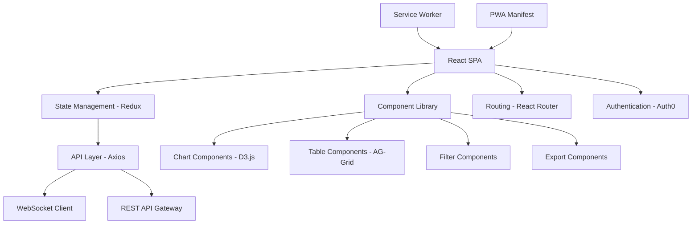
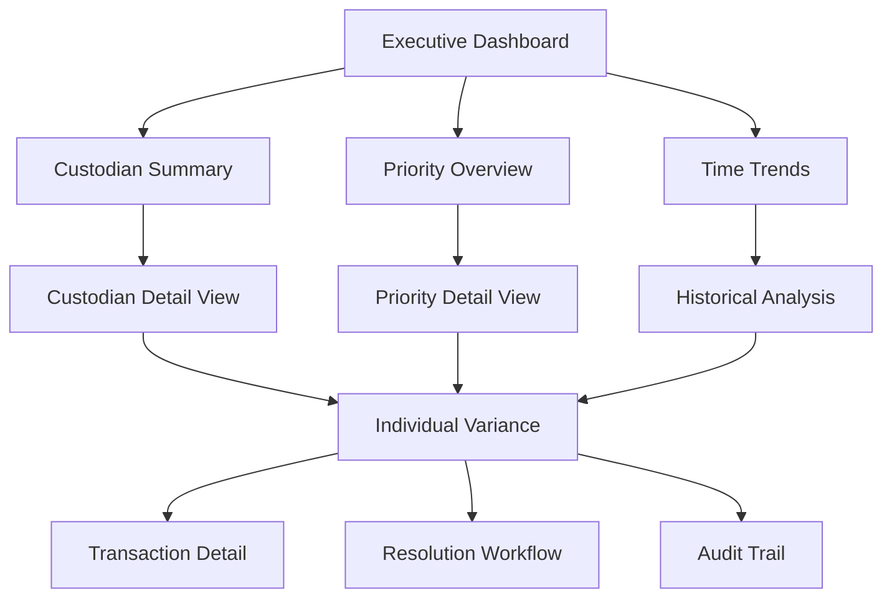

# Feature Specification - Dashboard de Divergências em Tempo Real

**Projeto**: Sistema de Conciliação BTG  
**Feature**: F003 - Dashboard de Análise de Divergências com Drill-Down  
**Data**: 25/07/2025  
**Baseado em**: Documentos AMBIMA + Requisitos BTG + UX Best Practices

---

## 1. FEATURE OVERVIEW

### 1.1 Descrição Funcional
Dashboard interativo em tempo real para visualização, análise e gestão de divergências de conciliação, oferecendo múltiplas camadas de drill-down (executivo → operacional → transacional), filtros avançados, exportação de relatórios e workflows integrados de resolução de divergências.

### 1.2 Business Value
- **Visibilidade Executiva**: Dashboards C-level com KPIs críticos
- **Eficiência Operacional**: Redução de 80% no tempo de análise
- **Tomada de Decisão**: Dados em tempo real para ações proativas
- **Compliance**: Relatórios automatizados para auditoria
- **Governança**: Controle total sobre processo de resolução

### 1.3 Success Criteria
- ✅ **Performance**: Carregamento <2s para dashboards principais
- ✅ **Usabilidade**: 95% dos usuários completam tarefas sem suporte
- ✅ **Disponibilidade**: 99.9% uptime durante horário comercial
- ✅ **Responsividade**: Layout funcional em desktop/tablet/mobile
- ✅ **Atualização**: Dados atualizados em tempo real (<30s)

### 1.4 Dependencies
- **Engine de Conciliação**: Dados de divergências populados
- **API Gateway**: Endpoints de consulta configurados
- **Sistema de Autenticação**: OAuth/RBAC implementado
- **Infraestrutura**: Load balancer e CDN configurados

---

## 2. ESPECIFICAÇÃO TÉCNICA

### 2.1 Arquitetura Frontend



### 2.2 Component Architecture

#### 2.2.1 Dashboard Container Structure
```typescript
interface DashboardProps {
  userRole: UserRole;
  permissions: Permission[];
  defaultFilters: FilterSet;
}

export const Dashboard: React.FC<DashboardProps> = ({
  userRole,
  permissions,
  defaultFilters
}) => {
  return (
    <DashboardLayout>
      <Header>
        <UserProfile />
        <NotificationCenter />
        <QuickActions />
      </Header>
      
      <Sidebar>
        <NavigationMenu role={userRole} />
        <FilterPanel filters={defaultFilters} />
      </Sidebar>
      
      <MainContent>
        <DashboardRouter>
          <Route path="/executive" component={ExecutiveDashboard} />
          <Route path="/operational" component={OperationalDashboard} />
          <Route path="/variance/:id" component={VarianceDetail} />
        </DashboardRouter>
      </MainContent>
      
      <Footer>
        <SystemStatus />
        <LastUpdateTime />
      </Footer>
    </DashboardLayout>
  );
};
```

#### 2.2.2 Real-time Data Integration
```typescript
interface VarianceData {
  id: number;
  custodian: string;
  fundCnpj: string;
  productIsin: string;
  varianceType: 'PRICE' | 'QUANTITY' | 'MOVEMENT';
  btgValue: number;
  custodianValue: number;
  varianceAmount: number;
  variancePercentage: number;
  riskScore: number;
  priority: 'LOW' | 'MEDIUM' | 'HIGH' | 'CRITICAL';
  status: 'OPEN' | 'INVESTIGATING' | 'RESOLVED';
  createdAt: Date;
  updatedAt: Date;
}

class VarianceWebSocketService {
  private ws: WebSocket;
  private subscribers: Map<string, (data: VarianceData) => void> = new Map();
  
  constructor() {
    this.connect();
  }
  
  private connect() {
    this.ws = new WebSocket('wss://api.btg.com/reconciliation/ws');
    
    this.ws.onmessage = (event) => {
      const message = JSON.parse(event.data);
      
      switch (message.type) {
        case 'VARIANCE_CREATED':
        case 'VARIANCE_UPDATED':
        case 'VARIANCE_RESOLVED':
          this.notifySubscribers(message.type, message.payload);
          break;
      }
    };
  }
  
  subscribe(eventType: string, callback: (data: VarianceData) => void) {
    this.subscribers.set(eventType, callback);
  }
}
```

### 2.3 Data Models e State Management

#### 2.3.1 Redux Store Structure
```typescript
interface RootState {
  auth: {
    user: User;
    permissions: Permission[];
    token: string;
  };
  
  variances: {
    items: VarianceData[];
    loading: boolean;
    error: string | null;
    filters: VarianceFilters;
    pagination: PaginationState;
    selectedItems: number[];
  };
  
  dashboard: {
    activeView: 'executive' | 'operational' | 'detail';
    refreshInterval: number;
    lastUpdate: Date;
    notifications: Notification[];
  };
  
  ui: {
    sidebarCollapsed: boolean;
    theme: 'light' | 'dark';
    language: 'pt-BR' | 'en-US';
    exportModal: {
      isOpen: boolean;
      format: 'xlsx' | 'pdf' | 'csv';
      filters: ExportFilters;
    };
  };
}
```

#### 2.3.2 API Integration Layer
```typescript
class VarianceApiService {
  private baseUrl = process.env.REACT_APP_API_BASE_URL;
  
  async getVariances(filters: VarianceFilters): Promise<VarianceResponse> {
    const queryParams = new URLSearchParams({
      custodian: filters.custodian || '',
      priority: filters.priority || '',
      status: filters.status || '',
      fromDate: filters.fromDate?.toISOString() || '',
      toDate: filters.toDate?.toISOString() || '',
      limit: filters.limit?.toString() || '100',
      offset: filters.offset?.toString() || '0'
    });
    
    const response = await fetch(
      `${this.baseUrl}/api/v1/reconciliation/variances?${queryParams}`,
      {
        headers: {
          'Authorization': `Bearer ${getAuthToken()}`,
          'Content-Type': 'application/json'
        }
      }
    );
    
    if (!response.ok) {
      throw new Error(`API Error: ${response.status} ${response.statusText}`);
    }
    
    return response.json();
  }
  
  async resolveVariance(varianceId: number, resolution: VarianceResolution): Promise<void> {
    await fetch(`${this.baseUrl}/api/v1/reconciliation/variances/${varianceId}/resolve`, {
      method: 'POST',
      headers: {
        'Authorization': `Bearer ${getAuthToken()}`,
        'Content-Type': 'application/json'
      },
      body: JSON.stringify(resolution)
    });
  }
}
```

### 2.4 Performance Optimization

#### 2.4.1 Virtualization Strategy
```typescript
import { FixedSizeList as List } from 'react-window';

interface VarianceRowProps {
  index: number;
  style: React.CSSProperties;
  data: VarianceData[];
}

const VarianceRow: React.FC<VarianceRowProps> = ({ index, style, data }) => (
  <div style={style} className="variance-row">
    <VarianceItem variance={data[index]} />
  </div>
);

export const VirtualizedVarianceList: React.FC<{ variances: VarianceData[] }> = ({ 
  variances 
}) => (
  <List
    height={600}
    itemCount={variances.length}
    itemSize={80}
    itemData={variances}
    overscanCount={5}
  >
    {VarianceRow}
  </List>
);
```

#### 2.4.2 Caching Strategy
```typescript
class CacheService {
  private cache = new Map<string, { data: any; expiry: number }>();
  private readonly TTL = 5 * 60 * 1000; // 5 minutes
  
  set(key: string, data: any, ttl: number = this.TTL): void {
    this.cache.set(key, {
      data,
      expiry: Date.now() + ttl
    });
  }
  
  get<T>(key: string): T | null {
    const item = this.cache.get(key);
    
    if (!item) return null;
    
    if (Date.now() > item.expiry) {
      this.cache.delete(key);
      return null;
    }
    
    return item.data as T;
  }
}
```

---

## 3. USER EXPERIENCE

### 3.1 Dashboard Layouts

#### 3.1.1 Executive Dashboard
```tsx
export const ExecutiveDashboard: React.FC = () => {
  return (
    <DashboardGrid>
      {/* KPI Cards Row */}
      <GridRow cols={4}>
        <KPICard
          title="Divergências Ativas"
          value={1247}
          change={+23}
          trend="up"
          critical={3}
        />
        <KPICard
          title="Risco Total"
          value="R$ 2.3MM"
          change={-0.12}
          trend="down"
          format="currency"
        />
        <KPICard
          title="Taxa de Resolução"
          value="92.3%"
          change={+1.2}
          trend="up"
          format="percentage"
        />
        <KPICard
          title="SLA Médio"
          value="2.4h"
          change={-0.3}
          trend="down"
          format="duration"
        />
      </GridRow>
      
      {/* Charts Row */}
      <GridRow cols={2}>
        <ChartCard title="Divergências por Prioridade">
          <PriorityDistributionChart data={priorityData} />
        </ChartCard>
        <ChartCard title="Evolução Temporal">
          <TimeSeriesChart data={timeSeriesData} />
        </ChartCard>
      </GridRow>
      
      {/* Details Row */}
      <GridRow cols={1}>
        <TableCard title="Top Divergências Críticas">
          <CriticalVariancesTable 
            data={criticalVariances}
            onRowClick={handleDrillDown}
          />
        </TableCard>
      </GridRow>
    </DashboardGrid>
  );
};
```

#### 3.1.2 Operational Dashboard
```tsx
export const OperationalDashboard: React.FC = () => {
  const [filters, setFilters] = useState<VarianceFilters>(defaultFilters);
  const [selectedVariances, setSelectedVariances] = useState<number[]>([]);
  
  return (
    <OperationalLayout>
      <FilterToolbar>
        <FilterGroup>
          <CustodianFilter value={filters.custodian} onChange={updateFilter} />
          <PriorityFilter value={filters.priority} onChange={updateFilter} />
          <StatusFilter value={filters.status} onChange={updateFilter} />
          <DateRangeFilter value={filters.dateRange} onChange={updateFilter} />
        </FilterGroup>
        
        <ActionGroup>
          <BulkActionsDropdown 
            selectedCount={selectedVariances.length}
            onAssign={handleBulkAssign}
            onResolve={handleBulkResolve}
          />
          <ExportButton filters={filters} />
          <RefreshButton onRefresh={handleRefresh} />
        </ActionGroup>
      </FilterToolbar>
      
      <VarianceDataGrid
        data={varianceData}
        filters={filters}
        selectedItems={selectedVariances}
        onSelectionChange={setSelectedVariances}
        onRowClick={handleVarianceClick}
        onSort={handleSort}
        onFilter={handleFilter}
      />
      
      <Pagination
        total={totalVariances}
        current={currentPage}
        pageSize={pageSize}
        onChange={handlePageChange}
      />
    </OperationalLayout>
  );
};
```

### 3.2 Interactive Components

#### 3.2.1 Advanced Data Grid
```tsx
interface DataGridColumn {
  key: string;
  title: string;
  width: number;
  sortable: boolean;
  filterable: boolean;
  renderer?: (value: any, row: VarianceData) => React.ReactNode;
}

const varianceColumns: DataGridColumn[] = [
  {
    key: 'id',
    title: 'ID',
    width: 80,
    sortable: true,
    filterable: false
  },
  {
    key: 'custodian',
    title: 'Custodiante',
    width: 120,
    sortable: true,
    filterable: true,
    renderer: (value) => <CustodianBadge name={value} />
  },
  {
    key: 'priority',
    title: 'Prioridade',
    width: 100,
    sortable: true,
    filterable: true,
    renderer: (value) => <PriorityBadge priority={value} />
  },
  {
    key: 'varianceAmount',
    title: 'Divergência',
    width: 150,
    sortable: true,
    filterable: false,
    renderer: (value) => <CurrencyCell value={value} />
  },
  {
    key: 'actions',
    title: 'Ações',
    width: 120,
    sortable: false,
    filterable: false,
    renderer: (_, row) => <ActionButtons variance={row} />
  }
];
```

#### 3.2.2 Real-time Notifications
```tsx
export const NotificationCenter: React.FC = () => {
  const [notifications, setNotifications] = useState<Notification[]>([]);
  const [isOpen, setIsOpen] = useState(false);
  
  useEffect(() => {
    const ws = new VarianceWebSocketService();
    
    ws.subscribe('VARIANCE_CREATED', (variance) => {
      if (variance.priority === 'CRITICAL') {
        addNotification({
          type: 'critical',
          title: 'Divergência Crítica Detectada',
          message: `${variance.custodian} - R$ ${formatCurrency(variance.varianceAmount)}`,
          timestamp: new Date(),
          action: {
            label: 'Investigar',
            onClick: () => navigateToVariance(variance.id)
          }
        });
      }
    });
    
    return () => ws.disconnect();
  }, []);
  
  return (
    <NotificationContainer>
      <NotificationBell 
        count={notifications.length}
        hasAlert={notifications.some(n => n.type === 'critical')}
        onClick={() => setIsOpen(!isOpen)}
      />
      
      {isOpen && (
        <NotificationPanel>
          <NotificationHeader>
            <h3>Notificações</h3>
            <ClearAllButton onClick={clearAllNotifications} />
          </NotificationHeader>
          
          <NotificationList>
            {notifications.map(notification => (
              <NotificationItem
                key={notification.id}
                notification={notification}
                onDismiss={dismissNotification}
              />
            ))}
          </NotificationList>
        </NotificationPanel>
      )}
    </NotificationContainer>
  );
};
```

### 3.3 Drill-Down Navigation

#### 3.3.1 Multi-Level Navigation


#### 3.3.2 Breadcrumb Navigation
```tsx
interface BreadcrumbItem {
  label: string;
  path: string;
  params?: Record<string, string>;
}

export const NavigationBreadcrumb: React.FC = () => {
  const location = useLocation();
  const navigate = useNavigate();
  
  const breadcrumbs = useMemo(() => {
    const items: BreadcrumbItem[] = [
      { label: 'Dashboard', path: '/dashboard' }
    ];
    
    if (location.pathname.includes('/variance/')) {
      const varianceId = location.pathname.split('/').pop();
      items.push(
        { label: 'Divergências', path: '/dashboard/operational' },
        { label: `Divergência #${varianceId}`, path: location.pathname }
      );
    }
    
    return items;
  }, [location.pathname]);
  
  return (
    <BreadcrumbContainer>
      {breadcrumbs.map((item, index) => (
        <React.Fragment key={item.path}>
          {index > 0 && <BreadcrumbSeparator />}
          <BreadcrumbLink
            onClick={() => navigate(item.path)}
            isActive={index === breadcrumbs.length - 1}
          >
            {item.label}
          </BreadcrumbLink>
        </React.Fragment>
      ))}
    </BreadcrumbContainer>
  );
};
```

### 3.4 Export e Reporting

#### 3.4.1 Export Modal
```tsx
interface ExportOptions {
  format: 'xlsx' | 'pdf' | 'csv';
  includeCharts: boolean;
  includeDetails: boolean;
  dateRange: DateRange;
  filters: VarianceFilters;
}

export const ExportModal: React.FC<{ isOpen: boolean; onClose: () => void }> = ({
  isOpen,
  onClose
}) => {
  const [options, setOptions] = useState<ExportOptions>({
    format: 'xlsx',
    includeCharts: true,
    includeDetails: true,
    dateRange: getDefaultDateRange(),
    filters: getActiveFilters()
  });
  
  const handleExport = async () => {
    try {
      setExporting(true);
      
      const exportService = new ExportService();
      const result = await exportService.exportVariances(options);
      
      // Download file
      const blob = new Blob([result.data], { 
        type: result.mimeType 
      });
      const url = URL.createObjectURL(blob);
      const link = document.createElement('a');
      link.href = url;
      link.download = result.filename;
      link.click();
      
      URL.revokeObjectURL(url);
      onClose();
      
    } catch (error) {
      showErrorNotification('Erro ao exportar dados');
    } finally {
      setExporting(false);
    }
  };
  
  return (
    <Modal isOpen={isOpen} onClose={onClose} title="Exportar Dados">
      <ExportForm>
        <FormatSelector
          value={options.format}
          onChange={(format) => setOptions({ ...options, format })}
        />
        
        <OptionsGroup>
          <Checkbox
            checked={options.includeCharts}
            onChange={(includeCharts) => setOptions({ ...options, includeCharts })}
            label="Incluir gráficos"
          />
          <Checkbox
            checked={options.includeDetails}
            onChange={(includeDetails) => setOptions({ ...options, includeDetails })}
            label="Incluir detalhes completos"
          />
        </OptionsGroup>
        
        <DateRangeSelector
          value={options.dateRange}
          onChange={(dateRange) => setOptions({ ...options, dateRange })}
        />
        
        <ButtonGroup>
          <Button variant="secondary" onClick={onClose}>
            Cancelar
          </Button>
          <Button 
            variant="primary" 
            onClick={handleExport}
            loading={exporting}
          >
            Exportar
          </Button>
        </ButtonGroup>
      </ExportForm>
    </Modal>
  );
};
```

---

## 4. INTEGRATION REQUIREMENTS

### 4.1 API Integration Patterns

#### 4.1.1 REST API Client
```typescript
class ApiClient {
  private baseURL: string;
  private timeout: number = 30000;
  
  constructor() {
    this.baseURL = process.env.REACT_APP_API_BASE_URL || '';
  }
  
  async request<T>(
    method: 'GET' | 'POST' | 'PUT' | 'DELETE',
    endpoint: string,
    data?: any,
    options?: RequestOptions
  ): Promise<T> {
    const url = `${this.baseURL}${endpoint}`;
    const config: RequestInit = {
      method,
      headers: {
        'Content-Type': 'application/json',
        'Authorization': `Bearer ${getAuthToken()}`,
        ...options?.headers
      },
      signal: AbortSignal.timeout(this.timeout)
    };
    
    if (data && method !== 'GET') {
      config.body = JSON.stringify(data);
    }
    
    const response = await fetch(url, config);
    
    if (!response.ok) {
      throw new ApiError(response.status, response.statusText);
    }
    
    return response.json();
  }
}
```

#### 4.1.2 WebSocket Integration
```typescript
interface WebSocketMessage {
  type: string;
  payload: any;
  timestamp: string;
}

class RealtimeService {
  private ws: WebSocket | null = null;
  private reconnectAttempts = 0;
  private maxReconnectAttempts = 5;
  private reconnectDelay = 1000;
  
  connect(): void {
    const wsUrl = process.env.REACT_APP_WS_URL || '';
    this.ws = new WebSocket(wsUrl);
    
    this.ws.onopen = () => {
      console.log('WebSocket connected');
      this.reconnectAttempts = 0;
      this.subscribe(['VARIANCE_CREATED', 'VARIANCE_UPDATED', 'VARIANCE_RESOLVED']);
    };
    
    this.ws.onmessage = (event) => {
      const message: WebSocketMessage = JSON.parse(event.data);
      this.handleMessage(message);
    };
    
    this.ws.onclose = () => {
      this.handleReconnect();
    };
  }
  
  private handleReconnect(): void {
    if (this.reconnectAttempts < this.maxReconnectAttempts) {
      this.reconnectAttempts++;
      setTimeout(() => {
        this.connect();
      }, this.reconnectDelay * this.reconnectAttempts);
    }
  }
}
```

### 4.2 Authentication Integration

#### 4.2.1 Auth0 Integration
```typescript
import { Auth0Provider, useAuth0 } from '@auth0/auth0-react';

const authConfig = {
  domain: process.env.REACT_APP_AUTH0_DOMAIN!,
  clientId: process.env.REACT_APP_AUTH0_CLIENT_ID!,
  audience: process.env.REACT_APP_AUTH0_AUDIENCE,
  redirectUri: window.location.origin,
  scope: 'openid profile email reconciliation:read reconciliation:write'
};

export const AuthProvider: React.FC<{ children: React.ReactNode }> = ({ 
  children 
}) => (
  <Auth0Provider {...authConfig}>
    {children}
  </Auth0Provider>
);

export const useAuthenticatedApi = () => {
  const { getAccessTokenSilently } = useAuth0();
  
  const apiClient = useMemo(() => {
    return new ApiClient({
      getToken: getAccessTokenSilently
    });
  }, [getAccessTokenSilently]);
  
  return apiClient;
};
```

#### 4.2.2 Role-Based Access Control
```typescript
interface UserPermissions {
  canViewExecutiveDashboard: boolean;
  canResolveVariances: boolean;
  canExportData: boolean;
  canConfigureAlerts: boolean;
  maxVarianceValue: number;
  allowedCustodians: string[];
}

export const usePermissions = (): UserPermissions => {
  const { user } = useAuth0();
  
  return useMemo(() => {
    const roles = user?.['https://btg.com/roles'] || [];
    const permissions: UserPermissions = {
      canViewExecutiveDashboard: false,
      canResolveVariances: false,
      canExportData: false,
      canConfigureAlerts: false,
      maxVarianceValue: 0,
      allowedCustodians: []
    };
    
    if (roles.includes('risk_manager')) {
      permissions.canViewExecutiveDashboard = true;
      permissions.canResolveVariances = true;
      permissions.canExportData = true;
      permissions.maxVarianceValue = 10000000; // 10MM
      permissions.allowedCustodians = ['ALL'];
    }
    
    if (roles.includes('senior_analyst')) {
      permissions.canResolveVariances = true;
      permissions.canExportData = true;
      permissions.maxVarianceValue = 1000000; // 1MM
      permissions.allowedCustodians = user?.['https://btg.com/custodians'] || [];
    }
    
    return permissions;
  }, [user]);
};
```

### 4.3 Monitoring Integration

#### 4.3.1 Performance Monitoring
```typescript
import { getCLS, getFID, getFCP, getLCP, getTTFB } from 'web-vitals';

class PerformanceMonitor {
  private static instance: PerformanceMonitor;
  
  static getInstance(): PerformanceMonitor {
    if (!PerformanceMonitor.instance) {
      PerformanceMonitor.instance = new PerformanceMonitor();
    }
    return PerformanceMonitor.instance;
  }
  
  init(): void {
    // Core Web Vitals
    getCLS(this.sendMetric);
    getFID(this.sendMetric);
    getFCP(this.sendMetric);
    getLCP(this.sendMetric);
    getTTFB(this.sendMetric);
    
    // Custom metrics
    this.trackDashboardLoadTime();
    this.trackAPIResponseTimes();
  }
  
  private sendMetric = (metric: any) => {
    // Send to monitoring service
    fetch('/api/metrics', {
      method: 'POST',
      body: JSON.stringify({
        name: metric.name,
        value: metric.value,
        timestamp: Date.now(),
        page: window.location.pathname
      })
    });
  };
}
```

#### 4.3.2 Error Tracking
```typescript
import * as Sentry from '@sentry/react';

Sentry.init({
  dsn: process.env.REACT_APP_SENTRY_DSN,
  environment: process.env.NODE_ENV,
  integrations: [
    new Sentry.BrowserTracing({
      routingInstrumentation: Sentry.reactRouterV6Instrumentation(
        React.useEffect,
        useLocation,
        useNavigationType,
        createRoutesFromChildren,
        matchRoutes
      ),
    }),
  ],
  tracesSampleRate: 0.1,
});

export const ErrorBoundary = Sentry.withErrorBoundary(Dashboard, {
  fallback: ErrorFallback,
  beforeCapture: (scope, error, errorInfo) => {
    scope.setTag('component', 'Dashboard');
    scope.setContext('errorInfo', errorInfo);
  }
});
```

---

## 5. COMPLIANCE & SECURITY

### 5.1 Data Security

#### 5.1.1 Client-Side Security
```typescript
class SecurityService {
  // Content Security Policy
  static initCSP(): void {
    const meta = document.createElement('meta');
    meta.httpEquiv = 'Content-Security-Policy';
    meta.content = `
      default-src 'self';
      script-src 'self' 'unsafe-inline' https://cdn.auth0.com;
      style-src 'self' 'unsafe-inline';
      img-src 'self' data: https:;
      connect-src 'self' wss: https://api.btg.com;
      font-src 'self' https://fonts.gstatic.com;
    `;
    document.head.appendChild(meta);
  }
  
  // Sensitive data masking
  static maskSensitiveData(data: any, userRole: string): any {
    if (userRole === 'viewer') {
      return {
        ...data,
        btgValue: '***',
        custodianValue: '***',
        varianceAmount: data.varianceAmount > 100000 ? '***' : data.varianceAmount
      };
    }
    return data;
  }
  
  // Session timeout
  static setupSessionTimeout(): void {
    let timeoutId: NodeJS.Timeout;
    
    const resetTimeout = () => {
      clearTimeout(timeoutId);
      timeoutId = setTimeout(() => {
        // Logout user
        window.location.href = '/logout';
      }, 30 * 60 * 1000); // 30 minutes
    };
    
    // Reset on user activity
    ['mousedown', 'mousemove', 'keypress', 'scroll', 'touchstart'].forEach(event => {
      document.addEventListener(event, resetTimeout, true);
    });
    
    resetTimeout();
  }
}
```

### 5.2 LGPD Compliance

#### 5.2.1 Data Privacy Controls
```typescript
interface PrivacySettings {
  allowAnalytics: boolean;
  allowPerformanceTracking: boolean;
  dataRetentionDays: number;
}

class PrivacyManager {
  static getConsent(): PrivacySettings {
    const stored = localStorage.getItem('privacy-settings');
    return stored ? JSON.parse(stored) : {
      allowAnalytics: false,
      allowPerformanceTracking: false,
      dataRetentionDays: 365
    };
  }
  
  static setConsent(settings: PrivacySettings): void {
    localStorage.setItem('privacy-settings', JSON.stringify(settings));
    
    // Apply settings
    if (!settings.allowAnalytics) {
      this.disableAnalytics();
    }
    
    if (!settings.allowPerformanceTracking) {
      this.disablePerformanceTracking();
    }
  }
  
  static requestDataDeletion(userId: string): Promise<void> {
    return fetch('/api/privacy/delete-user-data', {
      method: 'POST',
      headers: { 'Content-Type': 'application/json' },
      body: JSON.stringify({ userId })
    }).then(response => {
      if (!response.ok) {
        throw new Error('Failed to request data deletion');
      }
    });
  }
}
```

### 5.3 Audit Trail

#### 5.3.1 User Action Logging
```typescript
interface UserAction {
  userId: string;
  action: string;
  resource: string;
  timestamp: Date;
  metadata: Record<string, any>;
  ipAddress: string;
  userAgent: string;
}

class AuditLogger {
  private static queue: UserAction[] = [];
  private static batchSize = 10;
  
  static logAction(action: string, resource: string, metadata: any): void {
    const userAction: UserAction = {
      userId: getCurrentUserId(),
      action,
      resource,
      timestamp: new Date(),
      metadata,
      ipAddress: getClientIP(),
      userAgent: navigator.userAgent
    };
    
    this.queue.push(userAction);
    
    if (this.queue.length >= this.batchSize) {
      this.flush();
    }
  }
  
  private static async flush(): Promise<void> {
    if (this.queue.length === 0) return;
    
    const batch = [...this.queue];
    this.queue = [];
    
    try {
      await fetch('/api/audit/log', {
        method: 'POST',
        headers: { 'Content-Type': 'application/json' },
        body: JSON.stringify(batch)
      });
    } catch (error) {
      // Re-queue on failure
      this.queue.unshift(...batch);
      console.error('Failed to log audit events:', error);
    }
  }
}
```

---

## 6. TESTING STRATEGY

### 6.1 Component Testing

#### 6.1.1 Unit Tests
```typescript
import { render, screen, fireEvent, waitFor } from '@testing-library/react';
import { VarianceDataGrid } from '../VarianceDataGrid';

describe('VarianceDataGrid', () => {
  const mockVariances: VarianceData[] = [
    {
      id: 1,
      custodian: 'ITAU',
      fundCnpj: '12.345.678/0001-90',
      productIsin: 'BRXYZ123',
      varianceType: 'PRICE',
      btgValue: 1000000,
      custodianValue: 1001000,
      varianceAmount: 1000,
      variancePercentage: 0.1,
      riskScore: 5,
      priority: 'MEDIUM',
      status: 'OPEN',
      createdAt: new Date(),
      updatedAt: new Date()
    }
  ];
  
  test('renders variance data correctly', () => {
    render(
      <VarianceDataGrid 
        data={mockVariances}
        onRowClick={jest.fn()}
        onSelectionChange={jest.fn()}
      />
    );
    
    expect(screen.getByText('ITAU')).toBeInTheDocument();
    expect(screen.getByText('R$ 1.000,00')).toBeInTheDocument();
    expect(screen.getByText('MEDIUM')).toBeInTheDocument();
  });
  
  test('handles row selection', async () => {
    const onSelectionChange = jest.fn();
    
    render(
      <VarianceDataGrid 
        data={mockVariances}
        onRowClick={jest.fn()}
        onSelectionChange={onSelectionChange}
      />
    );
    
    const checkbox = screen.getByRole('checkbox');
    fireEvent.click(checkbox);
    
    await waitFor(() => {
      expect(onSelectionChange).toHaveBeenCalledWith([1]);
    });
  });
});
```

#### 6.1.2 Integration Tests
```typescript
import { renderWithProviders } from '../test-utils';
import { ExecutiveDashboard } from '../ExecutiveDashboard';
import { rest } from 'msw';
import { setupServer } from 'msw/node';

const server = setupServer(
  rest.get('/api/v1/reconciliation/variances/summary', (req, res, ctx) => {
    return res(ctx.json({
      totalVariances: 1247,
      criticalCount: 3,
      totalRiskAmount: 2300000,
      resolutionRate: 0.923
    }));
  })
);

beforeAll(() => server.listen());
afterEach(() => server.resetHandlers());
afterAll(() => server.close());

describe('ExecutiveDashboard Integration', () => {
  test('loads and displays KPI data', async () => {
    renderWithProviders(<ExecutiveDashboard />);
    
    await waitFor(() => {
      expect(screen.getByText('1,247')).toBeInTheDocument();
      expect(screen.getByText('R$ 2.3MM')).toBeInTheDocument();
      expect(screen.getByText('92.3%')).toBeInTheDocument();
    });
  });
});
```

### 6.2 Performance Testing

#### 6.2.1 Load Testing
```typescript
// Performance benchmark tests
describe('Dashboard Performance', () => {
  test('renders large dataset within performance budget', async () => {
    const largeDataset = generateMockVariances(10000);
    
    const startTime = performance.now();
    
    render(
      <VirtualizedVarianceList variances={largeDataset} />
    );
    
    const endTime = performance.now();
    const renderTime = endTime - startTime;
    
    // Should render within 100ms
    expect(renderTime).toBeLessThan(100);
  });
  
  test('handles real-time updates efficiently', async () => {
    const { rerender } = render(<VarianceCounter count={1000} />);
    
    const updates = Array.from({ length: 100 }, (_, i) => i + 1001);
    
    const startTime = performance.now();
    
    for (const count of updates) {
      rerender(<VarianceCounter count={count} />);
    }
    
    const endTime = performance.now();
    const totalTime = endTime - startTime;
    
    // 100 updates should complete in under 50ms
    expect(totalTime).toBeLessThan(50);
  });
});
```

### 6.3 E2E Testing

#### 6.3.1 Cypress Tests
```typescript
describe('Dashboard E2E Tests', () => {
  beforeEach(() => {
    cy.login('risk_manager');
    cy.visit('/dashboard');
  });
  
  it('should navigate from executive to operational dashboard', () => {
    // Start at executive dashboard
    cy.get('[data-testid="executive-dashboard"]').should('be.visible');
    
    // Click on a critical variance
    cy.get('[data-testid="critical-variance-row"]').first().click();
    
    // Should navigate to operational dashboard with filters
    cy.url().should('include', '/dashboard/operational');
    cy.get('[data-testid="priority-filter"]').should('have.value', 'CRITICAL');
  });
  
  it('should export variance data', () => {
    cy.get('[data-testid="export-button"]').click();
    cy.get('[data-testid="export-modal"]').should('be.visible');
    
    cy.get('[data-testid="format-xlsx"]').click();
    cy.get('[data-testid="export-confirm"]').click();
    
    // Verify download started
    cy.readFile('cypress/downloads/variances.xlsx').should('exist');
  });
  
  it('should handle real-time variance updates', () => {
    // Mock WebSocket message
    cy.window().then((win) => {
      win.postMessage({
        type: 'VARIANCE_CREATED',
        payload: {
          id: 9999,
          priority: 'CRITICAL',
          custodian: 'TEST_BANK'
        }
      }, '*');
    });
    
    // Verify notification appears
    cy.get('[data-testid="notification-bell"]').should('have.class', 'has-alert');
    cy.get('[data-testid="notification-bell"]').click();
    cy.contains('Divergência Crítica Detectada').should('be.visible');
  });
});
```

---

## 7. ACCEPTANCE CRITERIA

### 7.1 Functional Requirements
- [ ] **AC001**: Dashboard carrega dados em <2s para até 10.000 divergências
- [ ] **AC002**: Filtros aplicam em tempo real (<500ms response)
- [ ] **AC003**: Drill-down funciona em 3 níveis (Executive → Operational → Detail)
- [ ] **AC004**: Exportação suporta XLSX, PDF e CSV com filtros aplicados
- [ ] **AC005**: Notificações em tempo real para divergências CRITICAL (<30s)
- [ ] **AC006**: Interface responsiva funciona em desktop, tablet e mobile
- [ ] **AC007**: Bulk actions funcionam para até 1000 divergências selecionadas

### 7.2 Performance Requirements
- [ ] **AC008**: TTI (Time to Interactive) <3s em conexão 3G
- [ ] **AC009**: CLS (Cumulative Layout Shift) <0.1 
- [ ] **AC010**: LCP (Largest Contentful Paint) <2.5s
- [ ] **AC011**: Suporta 100 usuários simultâneos sem degradação
- [ ] **AC012**: WebSocket reconnect automático em <5s
- [ ] **AC013**: Virtualização eficiente para listas >1000 itens

### 7.3 Security Requirements
- [ ] **AC014**: Autenticação OAuth 2.0 + mTLS obrigatória
- [ ] **AC015**: RBAC implementado para todos os componentes
- [ ] **AC016**: Dados sensíveis mascarados baseado em perfil
- [ ] **AC017**: Session timeout configurável (padrão 30min)
- [ ] **AC018**: CSP (Content Security Policy) implementado
- [ ] **AC019**: Audit log para todas as ações de usuário

### 7.4 Usability Requirements
- [ ] **AC020**: Atalhos de teclado para ações principais
- [ ] **AC021**: Breadcrumb navigation em todos os níveis
- [ ] **AC022**: Loading states para todas as operações >500ms
- [ ] **AC023**: Error states com mensagens actionable
- [ ] **AC024**: Tooltips informativos em campos técnicos
- [ ] **AC025**: Modo escuro/claro disponível

---

## 8. IMPLEMENTATION ROADMAP

### 8.1 Sprint 1-2 (Semanas 1-4) - Foundation
- [ ] **React App Setup**: Create React App + TypeScript
- [ ] **Design System**: Component library base
- [ ] **Authentication**: Auth0 integration
- [ ] **API Client**: REST client + error handling
- [ ] **Basic Layout**: Header, sidebar, main content

### 8.2 Sprint 3-4 (Semanas 5-8) - Core Features  
- [ ] **Executive Dashboard**: KPI cards + charts
- [ ] **Data Grid**: Advanced table with sorting/filtering
- [ ] **Real-time Updates**: WebSocket integration
- [ ] **Navigation**: Routing + breadcrumbs
- [ ] **Responsive Design**: Mobile/tablet layouts

### 8.3 Sprint 5-6 (Semanas 9-12) - Advanced Features
- [ ] **Operational Dashboard**: Detailed variance management
- [ ] **Export System**: Multi-format export
- [ ] **Bulk Actions**: Mass operations
- [ ] **Notifications**: Real-time alerts
- [ ] **Performance Optimization**: Virtualization + caching

### 8.4 Sprint 7-8 (Semanas 13-16) - Production Ready
- [ ] **Security Hardening**: CSP, audit logging
- [ ] **Monitoring**: Performance + error tracking
- [ ] **Testing**: Unit + E2E test coverage >80%
- [ ] **Documentation**: User guides + API docs
- [ ] **Deployment**: CI/CD pipeline + CDN

---

**Feature Owner**: Head of Digital Experience BTG  
**Frontend Lead**: Senior React Developer  
**UX Designer**: Senior Product Designer  
**Key Stakeholders**: Risk Management, Operations, IT Security