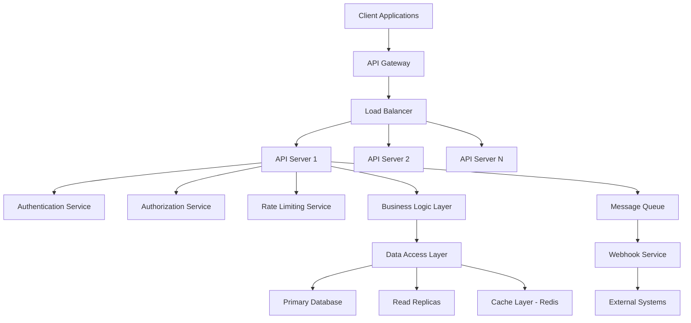

# Feature Specification - API de Dados de Conciliação

**Projeto**: Sistema de Conciliação BTG  
**Feature**: F004 - API REST para Consulta e Gestão de Dados  
**Data**: 25/07/2025  
**Baseado em**: Documentos AMBIMA + Requisitos BTG + REST API Best Practices

---

## 1. FEATURE OVERVIEW

### 1.1 Descrição Funcional
API REST robusta e escalável para consulta de posições, movimentações e divergências do sistema de conciliação, oferecendo integração nativa com sistemas de valoração BTG, suporte a consultas complexas, filtragem avançada, paginação eficiente e webhooks para notificações em tempo real.

### 1.2 Business Value
- **Integração Sistêmica**: Hub central para todos os sistemas BTG
- **Automação**: APIs para workflows automatizados
- **Flexibilidade**: Consultas ad-hoc para análises customizadas
- **Escalabilidade**: Suporte a alto volume de requisições
- **Governança**: Controle centralizado de acesso a dados

### 1.3 Success Criteria
- ✅ **Performance**: 95% das consultas em <500ms
- ✅ **Throughput**: 10.000 req/min por instância
- ✅ **Disponibilidade**: 99.99% uptime (4.32min downtime/mês)
- ✅ **Adoção**: 15+ sistemas integrados em 6 meses
- ✅ **Satisfação**: NPS >80 dos desenvolvedores consumidores

### 1.4 Dependencies
- **Base de Dados**: Schema normalizado e otimizado
- **Cache Layer**: Redis para performance
- **API Gateway**: Kong ou AWS API Gateway
- **Monitoring**: Prometheus + Grafana para observabilidade

---

## 2. ESPECIFICAÇÃO TÉCNICA

### 2.1 Arquitetura da API



### 2.2 OpenAPI 3.0 Specification

#### 2.2.1 API Base Configuration
```yaml
openapi: 3.0.3
info:
  title: BTG Reconciliation API
  description: API para acesso aos dados de conciliação de custodiantes externos
  version: 2.0.0
  contact:
    name: API Support
    email: api-support@btg.com
    url: https://docs.btg.com/reconciliation-api
  license:
    name: Proprietary
    url: https://btg.com/license

servers:
  - url: https://api.btg.com/reconciliation/v2
    description: Production server
  - url: https://api-staging.btg.com/reconciliation/v2
    description: Staging server

security:
  - OAuth2: [reconciliation:read, reconciliation:write]
  - ApiKey: []

components:
  securitySchemes:
    OAuth2:
      type: oauth2
      flows:
        clientCredentials:
          tokenUrl: https://auth.btg.com/oauth2/token
          scopes:
            reconciliation:read: Read access to reconciliation data
            reconciliation:write: Write access to reconciliation data
            reconciliation:admin: Administrative access
    
    ApiKey:
      type: apiKey
      in: header
      name: X-API-Key
```

#### 2.2.2 Data Models
```yaml
components:
  schemas:
    Variance:
      type: object
      required: [id, custodian, fundCnpj, varianceType, btgValue, custodianValue]
      properties:
        id:
          type: integer
          format: int64
          example: 12345
        custodian:
          type: string
          enum: [ITAU, BRADESCO, SANTANDER, BB, CAIXA]
          example: ITAU
        fundCnpj:
          type: string
          pattern: '^\d{2}\.\d{3}\.\d{3}/\d{4}-\d{2}$'
          example: "12.345.678/0001-90"
        productIsin:
          type: string
          pattern: '^[A-Z]{2}[A-Z0-9]{10}$'
          example: "BRXYZABCDEF1"
        varianceType:
          type: string
          enum: [PRICE, QUANTITY, MOVEMENT]
          example: PRICE
        btgValue:
          type: number
          format: decimal
          multipleOf: 0.000001
          example: 1234567.89
        custodianValue:
          type: number
          format: decimal
          multipleOf: 0.000001
          example: 1234890.12
        varianceAmount:
          type: number
          format: decimal
          multipleOf: 0.000001
          example: 322.23
        variancePercentage:
          type: number
          format: float
          minimum: -100
          maximum: 100
          example: 0.026
        riskScore:
          type: integer
          minimum: 1
          maximum: 10
          example: 7
        priority:
          type: string
          enum: [LOW, MEDIUM, HIGH, CRITICAL]
          example: HIGH
        status:
          type: string
          enum: [OPEN, INVESTIGATING, RESOLVED, FALSE_POSITIVE]
          example: OPEN
        assignedTo:
          type: string
          nullable: true
          example: "analyst@btg.com"
        resolutionNotes:
          type: string
          nullable: true
          maxLength: 2000
        createdAt:
          type: string
          format: date-time
          example: "2025-07-25T14:30:00Z"
        updatedAt:
          type: string
          format: date-time
          example: "2025-07-25T16:45:00Z"
        metadata:
          type: object
          additionalProperties: true
          
    Position:
      type: object
      required: [fundCnpj, productIsin, positionDate, quantity, unitValue]
      properties:
        fundCnpj:
          type: string
          pattern: '^\d{2}\.\d{3}\.\d{3}/\d{4}-\d{2}$'
        productIsin:
          type: string
          pattern: '^[A-Z]{2}[A-Z0-9]{10}$'  
        positionDate:
          type: string
          format: date
        quantity:
          type: number
          format: decimal
          multipleOf: 0.000001
        unitValue:
          type: number
          format: decimal
          multipleOf: 0.000001
        totalValue:
          type: number
          format: decimal
          multipleOf: 0.01
        custodian:
          type: string
          enum: [BTG, ITAU, BRADESCO, SANTANDER, BB, CAIXA]
        
    PaginatedResponse:
      type: object
      required: [data, pagination]
      properties:
        data:
          type: array
          items: {}
        pagination:
          $ref: '#/components/schemas/Pagination'
          
    Pagination:
      type: object
      required: [total, limit, offset, hasNext, hasPrevious]
      properties:
        total:
          type: integer
          minimum: 0
          example: 15423
        limit:
          type: integer
          minimum: 1
          maximum: 1000
          example: 100
        offset:
          type: integer
          minimum: 0
          example: 1200
        hasNext:
          type: boolean
          example: true
        hasPrevious:
          type: boolean
          example: true
        totalPages:
          type: integer
          minimum: 1
          example: 155
        currentPage:
          type: integer
          minimum: 1
          example: 13
```

### 2.3 Core Endpoints

#### 2.3.1 Variance Management
```yaml
paths:
  /variances:
    get:
      summary: Listar divergências
      description: Recupera lista paginada de divergências com filtros opcionais
      tags: [Variances]
      security:
        - OAuth2: [reconciliation:read]
      parameters:
        - name: custodian
          in: query
          schema:
            type: string
            enum: [ITAU, BRADESCO, SANTANDER, BB, CAIXA]
        - name: priority
          in: query
          schema:
            type: array
            items:
              type: string
              enum: [LOW, MEDIUM, HIGH, CRITICAL]
        - name: status
          in: query
          schema:
            type: string
            enum: [OPEN, INVESTIGATING, RESOLVED, FALSE_POSITIVE]
        - name: fromDate
          in: query
          schema:
            type: string
            format: date
        - name: toDate
          in: query
          schema:
            type: string
            format: date
        - name: minAmount
          in: query
          schema:
            type: number
            format: decimal
        - name: maxAmount
          in: query
          schema:
            type: number
            format: decimal
        - name: fundCnpj
          in: query
          schema:
            type: array
            items:
              type: string
        - name: sortBy
          in: query
          schema:
            type: string
            enum: [id, createdAt, updatedAt, varianceAmount, riskScore]
            default: createdAt
        - name: sortOrder
          in: query
          schema:
            type: string
            enum: [asc, desc]
            default: desc
        - name: limit
          in: query
          schema:
            type: integer
            minimum: 1
            maximum: 1000
            default: 100
        - name: offset
          in: query
          schema:
            type: integer
            minimum: 0
            default: 0
      responses:
        '200':
          description: Lista de divergências
          content:
            application/json:
              schema:
                allOf:
                  - $ref: '#/components/schemas/PaginatedResponse'
                  - type: object
                    properties:
                      data:
                        type: array
                        items:
                          $ref: '#/components/schemas/Variance'
        '400':
          $ref: '#/components/responses/BadRequest'
        '401':
          $ref: '#/components/responses/Unauthorized'
        '403':
          $ref: '#/components/responses/Forbidden'
        '429':
          $ref: '#/components/responses/TooManyRequests'
        '500':
          $ref: '#/components/responses/InternalServerError'
          
  /variances/{varianceId}:
    get:
      summary: Obter divergência específica
      tags: [Variances]
      security:
        - OAuth2: [reconciliation:read]
      parameters:
        - name: varianceId
          in: path
          required: true
          schema:
            type: integer
            format: int64
      responses:
        '200':
          description: Detalhes da divergência
          content:
            application/json:
              schema:
                $ref: '#/components/schemas/Variance'
        '404':
          $ref: '#/components/responses/NotFound'
          
    patch:
      summary: Atualizar divergência
      tags: [Variances]
      security:
        - OAuth2: [reconciliation:write]
      parameters:
        - name: varianceId
          in: path
          required: true
          schema:
            type: integer
            format: int64
      requestBody:
        required: true
        content:
          application/json:
            schema:
              type: object
              properties:
                status:
                  type: string
                  enum: [INVESTIGATING, RESOLVED, FALSE_POSITIVE]
                assignedTo:
                  type: string
                  format: email
                resolutionNotes:
                  type: string
                  maxLength: 2000
                priority:
                  type: string
                  enum: [LOW, MEDIUM, HIGH, CRITICAL]
      responses:
        '200':
          description: Divergência atualizada
          content:
            application/json:
              schema:
                $ref: '#/components/schemas/Variance'
        '400':
          $ref: '#/components/responses/BadRequest'
        '404':
          $ref: '#/components/responses/NotFound'
```

#### 2.3.2 Position Data Access
```yaml
  /positions:
    get:
      summary: Consultar posições
      description: Recupera posições de fundos com filtros por data, custodiante, etc.
      tags: [Positions]
      security:
        - OAuth2: [reconciliation:read]
      parameters:
        - name: fundCnpj
          in: query
          required: true
          schema:
            type: array
            items:
              type: string
        - name: positionDate
          in: query
          required: true
          schema:
            type: string
            format: date
        - name: custodian
          in: query
          schema:
            type: string
            enum: [BTG, ITAU, BRADESCO, SANTANDER, BB, CAIXA]
        - name: productIsin
          in: query
          schema:
            type: array
            items:
              type: string
        - name: includeZeroPositions
          in: query
          schema:
            type: boolean
            default: false
      responses:
        '200':
          description: Lista de posições
          content:
            application/json:
              schema:
                allOf:
                  - $ref: '#/components/schemas/PaginatedResponse'
                  - type: object
                    properties:
                      data:
                        type: array
                        items:
                          $ref: '#/components/schemas/Position'
                      summary:
                        type: object
                        properties:
                          totalPositions:
                            type: integer
                          totalValue:
                            type: number
                            format: decimal
                          custodianBreakdown:
                            type: object
                            additionalProperties:
                              type: number
                              format: decimal
```

#### 2.3.3 Reconciliation Operations
```yaml
  /reconciliation/runs:
    get:
      summary: Listar execuções de conciliação
      tags: [Reconciliation]
      security:
        - OAuth2: [reconciliation:read]
      parameters:
        - name: status
          in: query
          schema:
            type: string
            enum: [RUNNING, COMPLETED, ERROR, CANCELLED]
        - name: fromDate
          in: query
          schema:
            type: string
            format: date
        - name: toDate
          in: query
          schema:
            type: string
            format: date
      responses:
        '200':
          description: Lista de execuções
          content:
            application/json:
              schema:
                type: array
                items:
                  type: object
                  properties:
                    id:
                      type: string
                      example: "rec_20250725_001"
                    runDate:
                      type: string
                      format: date
                    status:
                      type: string
                      enum: [RUNNING, COMPLETED, ERROR, CANCELLED]
                    totalPositions:
                      type: integer
                    matchedPositions:
                      type: integer
                    varianceCount:
                      type: integer
                    executionTimeMs:
                      type: integer
                    createdAt:
                      type: string
                      format: date-time
                      
    post:
      summary: Executar conciliação manual
      tags: [Reconciliation]
      security:
        - OAuth2: [reconciliation:write]
      requestBody:
        required: true
        content:
          application/json:
            schema:
              type: object
              required: [cutoffDate]
              properties:
                cutoffDate:
                  type: string
                  format: date
                custodians:
                  type: array
                  items:
                    type: string
                    enum: [ITAU, BRADESCO, SANTANDER, BB, CAIXA]
                funds:
                  type: array
                  items:
                    type: string
                includeMovements:
                  type: boolean
                  default: true
                notificationRecipients:
                  type: array
                  items:
                    type: string
                    format: email
      responses:
        '202':
          description: Conciliação iniciada
          content:
            application/json:
              schema:
                type: object
                properties:
                  runId:
                    type: string
                    example: "rec_20250725_002"
                  status:
                    type: string
                    example: "RUNNING"
                  estimatedCompletion:
                    type: string
                    format: date-time
                  trackingUrl:
                    type: string
                    format: uri
                    example: "/reconciliation/runs/rec_20250725_002"
```

### 2.4 Advanced Features

#### 2.4.1 Bulk Operations
```yaml
  /variances/bulk:
    patch:
      summary: Operações em lote
      description: Atualiza múltiplas divergências simultaneamente
      tags: [Variances]
      security:
        - OAuth2: [reconciliation:write]
      requestBody:
        required: true
        content:
          application/json:
            schema:
              type: object
              required: [varianceIds, operation]
              properties:
                varianceIds:
                  type: array
                  items:
                    type: integer
                    format: int64
                  maxItems: 1000
                operation:
                  type: object
                  required: [type]
                  properties:
                    type:
                      type: string
                      enum: [ASSIGN, UPDATE_STATUS, UPDATE_PRIORITY]
                    assignedTo:
                      type: string
                      format: email
                    status:
                      type: string
                      enum: [INVESTIGATING, RESOLVED, FALSE_POSITIVE]
                    priority:
                      type: string
                      enum: [LOW, MEDIUM, HIGH, CRITICAL]
                    notes:
                      type: string
                      maxLength: 2000
      responses:
        '202':
          description: Operação em lote iniciada
          content:
            application/json:
              schema:
                type: object
                properties:
                  jobId:
                    type: string
                    example: "bulk_job_abc123"
                  status:
                    type: string
                    example: "PROCESSING"
                  affectedCount:
                    type: integer
                    example: 245
                  trackingUrl:
                    type: string
                    example: "/jobs/bulk_job_abc123"
```

#### 2.4.2 Analytics Endpoints
```yaml
  /analytics/variance-trends:
    get:
      summary: Tendências de divergências
      tags: [Analytics]
      security:
        - OAuth2: [reconciliation:read]
      parameters:
        - name: period
          in: query
          required: true
          schema:
            type: string
            enum: [7d, 30d, 90d, 1y]
        - name: groupBy
          in: query
          schema:
            type: string
            enum: [day, week, month]
            default: day
        - name: custodian
          in: query
          schema:
            type: string
      responses:
        '200':
          description: Dados de tendência
          content:
            application/json:
              schema:
                type: object
                properties:
                  period:
                    type: string
                  dataPoints:
                    type: array
                    items:
                      type: object
                      properties:
                        date:
                          type: string
                          format: date
                        totalVariances:
                          type: integer
                        criticalCount:
                          type: integer
                        totalAmount:
                          type: number
                          format: decimal
                        resolutionRate:
                          type: number
                          format: float
                          
  /analytics/performance-metrics:
    get:
      summary: Métricas de performance
      tags: [Analytics]
      security:
        - OAuth2: [reconciliation:read]
      responses:
        '200':
          description: Métricas do sistema
          content:
            application/json:
              schema:
                type: object
                properties:
                  reconciliation:
                    type: object
                    properties:
                      averageExecutionTime:
                        type: number
                        description: Tempo médio em segundos
                      positionsProcessedPerHour:
                        type: integer
                      errorRate:
                        type: number
                        format: float
                  variance:
                    type: object
                    properties:
                      averageResolutionTime:
                        type: number
                        description: Tempo médio em horas
                      falsePositiveRate:
                        type: number
                        format: float
                      slaCompliance:
                        type: number
                        format: float
```

### 2.5 WebHook System

#### 2.5.1 Webhook Configuration
```yaml
  /webhooks:
    get:
      summary: Listar webhooks configurados
      tags: [Webhooks]
      security:
        - OAuth2: [reconciliation:admin]
      responses:
        '200':
          description: Lista de webhooks
          content:
            application/json:
              schema:
                type: array
                items:
                  $ref: '#/components/schemas/Webhook'
                  
    post:
      summary: Criar webhook
      tags: [Webhooks]
      security:
        - OAuth2: [reconciliation:admin]
      requestBody:
        required: true
        content:
          application/json:
            schema:
              type: object
              required: [url, events]
              properties:
                url:
                  type: string
                  format: uri
                  example: "https://client-system.btg.com/webhooks/reconciliation"
                events:
                  type: array
                  items:
                    type: string
                    enum: [
                      variance.created,
                      variance.updated,
                      variance.resolved,
                      reconciliation.completed,
                      reconciliation.failed
                    ]
                secret:
                  type: string
                  description: Chave secreta para assinatura HMAC
                active:
                  type: boolean
                  default: true
                filters:
                  type: object
                  properties:
                    custodians:
                      type: array
                      items:
                        type: string
                    priorityMin:
                      type: string
                      enum: [LOW, MEDIUM, HIGH, CRITICAL]
                    amountMin:
                      type: number
                      format: decimal
      responses:
        '201':
          description: Webhook criado
          content:
            application/json:
              schema:
                $ref: '#/components/schemas/Webhook'

components:
  schemas:
    Webhook:
      type: object
      properties:
        id:
          type: string
          example: "webhook_abc123"
        url:
          type: string
          format: uri
        events:
          type: array
          items:
            type: string
        active:
          type: boolean
        createdAt:
          type: string
          format: date-time
        lastDelivery:
          type: string
          format: date-time
          nullable: true
        deliveryStats:
          type: object
          properties:
            totalDeliveries:
              type: integer
            successCount:
              type: integer
            failureCount:
              type: integer
            lastStatusCode:
              type: integer
```

---

## 3. IMPLEMENTATION DETAILS

### 3.1 Technology Stack

#### 3.1.1 Backend Framework
```csharp
// ASP.NET Core 6.0 API
[ApiController]
[Route("api/v2/[controller]")]
[Authorize]
public class VariancesController : ControllerBase
{
    private readonly IVarianceService _varianceService;
    private readonly IMapper _mapper;
    private readonly ILogger<VariancesController> _logger;
    
    public VariancesController(
        IVarianceService varianceService,
        IMapper mapper,
        ILogger<VariancesController> logger)
    {
        _varianceService = varianceService;
        _mapper = mapper;
        _logger = logger;
    }
    
    [HttpGet]
    [ProducesResponseType(typeof(PaginatedResponse<VarianceDto>), 200)]
    [ProducesResponseType(400)]
    [ProducesResponseType(401)]
    [ProducesResponseType(403)]
    public async Task<IActionResult> GetVariances(
        [FromQuery] VarianceQueryParameters parameters)
    {
        try
        {
            // Validate query parameters
            if (!ModelState.IsValid)
            {
                return BadRequest(ModelState);
            }
            
            // Apply user-based filtering
            var userContext = HttpContext.GetUserContext();
            parameters = ApplyUserFilters(parameters, userContext);
            
            // Execute query
            var result = await _varianceService.GetVariancesAsync(parameters);
            var dto = _mapper.Map<PaginatedResponse<VarianceDto>>(result);
            
            // Log successful request
            _logger.LogInformation("Variances retrieved: {Count} items for user {UserId}", 
                result.Data.Count(), userContext.UserId);
            
            return Ok(dto);
        }
        catch (ValidationException ex)
        {
            _logger.LogWarning(ex, "Validation error in GetVariances");
            return BadRequest(new { error = ex.Message });
        }
        catch (UnauthorizedAccessException ex)
        {
            _logger.LogWarning(ex, "Unauthorized access attempt");
            return Forbid();
        }
        catch (Exception ex)
        {
            _logger.LogError(ex, "Unexpected error in GetVariances");
            return StatusCode(500, new { error = "Internal server error" });
        }
    }
}
```

#### 3.1.2 Data Access Layer
```csharp
public interface IVarianceRepository
{
    Task<PaginatedResult<Variance>> GetVariancesAsync(VarianceQueryParameters parameters);
    Task<Variance?> GetVarianceByIdAsync(long id);
    Task<Variance> UpdateVarianceAsync(Variance variance);
    Task<BulkOperationResult> BulkUpdateVariancesAsync(BulkUpdateRequest request);
}

public class VarianceRepository : IVarianceRepository
{
    private readonly ReconciliationDbContext _context;
    private readonly IMemoryCache _cache;
    
    public async Task<PaginatedResult<Variance>> GetVariancesAsync(
        VarianceQueryParameters parameters)
    {
        var query = _context.Variances.AsQueryable();
        
        // Apply filters
        if (parameters.Custodian != null)
            query = query.Where(v => v.Custodian == parameters.Custodian);
            
        if (parameters.Priority?.Any() == true)
            query = query.Where(v => parameters.Priority.Contains(v.Priority));
            
        if (parameters.Status != null)
            query = query.Where(v => v.Status == parameters.Status);
            
        if (parameters.FromDate.HasValue)
            query = query.Where(v => v.CreatedAt >= parameters.FromDate);
            
        if (parameters.ToDate.HasValue)
            query = query.Where(v => v.CreatedAt <= parameters.ToDate);
            
        if (parameters.MinAmount.HasValue)
            query = query.Where(v => Math.Abs(v.VarianceAmount) >= parameters.MinAmount);
            
        if (parameters.MaxAmount.HasValue)
            query = query.Where(v => Math.Abs(v.VarianceAmount) <= parameters.MaxAmount);
            
        // Apply sorting
        query = parameters.SortBy switch
        {
            "id" => parameters.SortOrder == "desc" 
                ? query.OrderByDescending(v => v.Id)
                : query.OrderBy(v => v.Id),
            "createdAt" => parameters.SortOrder == "desc"
                ? query.OrderByDescending(v => v.CreatedAt)
                : query.OrderBy(v => v.CreatedAt),
            "varianceAmount" => parameters.SortOrder == "desc"
                ? query.OrderByDescending(v => Math.Abs(v.VarianceAmount))
                : query.OrderBy(v => Math.Abs(v.VarianceAmount)),
            "riskScore" => parameters.SortOrder == "desc"
                ? query.OrderByDescending(v => v.RiskScore)
                : query.OrderBy(v => v.RiskScore),
            _ => query.OrderByDescending(v => v.CreatedAt)
        };
        
        // Get total count
        var totalCount = await query.CountAsync();
        
        // Apply pagination
        var items = await query
            .Skip(parameters.Offset)
            .Take(parameters.Limit)
            .ToListAsync();
            
        return new PaginatedResult<Variance>
        {
            Data = items,
            Total = totalCount,
            Limit = parameters.Limit,
            Offset = parameters.Offset,
            HasNext = parameters.Offset + parameters.Limit < totalCount,
            HasPrevious = parameters.Offset > 0
        };
    }
}
```

### 3.2 Authentication & Authorization

#### 3.2.1 JWT Token Validation
```csharp
public class JwtAuthenticationMiddleware
{
    private readonly RequestDelegate _next;
    private readonly IConfiguration _configuration;
    
    public async Task InvokeAsync(HttpContext context)
    {
        var token = ExtractTokenFromHeader(context.Request);
        
        if (token != null)
        {
            try
            {
                var principal = ValidateToken(token);
                context.User = principal;
                
                // Add user context
                var userContext = new UserContext
                {
                    UserId = principal.FindFirst("sub")?.Value,
                    Email = principal.FindFirst("email")?.Value,
                    Roles = principal.FindAll("role").Select(c => c.Value).ToList(),
                    Scopes = principal.FindAll("scope").Select(c => c.Value).ToList(),
                    AllowedCustodians = principal.FindAll("custodian").Select(c => c.Value).ToList()
                };
                
                context.Items["UserContext"] = userContext;
            }
            catch (SecurityTokenException ex)
            {
                // Log and continue without authentication
                context.Response.StatusCode = 401;
                await context.Response.WriteAsync("Invalid token");
                return;
            }
        }
        
        await _next(context);
    }
}
```

#### 3.2.2 Role-Based Authorization
```csharp
[AttributeUsage(AttributeTargets.Method | AttributeTargets.Class)]
public class RequireRoleAttribute : Attribute, IAuthorizationRequirement
{
    public string[] Roles { get; }
    
    public RequireRoleAttribute(params string[] roles)
    {
        Roles = roles;
    }
}

public class RoleAuthorizationHandler : AuthorizationHandler<RequireRoleAttribute>
{
    protected override Task HandleRequirementAsync(
        AuthorizationHandlerContext context,
        RequireRoleAttribute requirement)
    {
        var userRoles = context.User.FindAll("role").Select(c => c.Value);
        
        if (requirement.Roles.Any(role => userRoles.Contains(role)))
        {
            context.Succeed(requirement);
        }
        
        return Task.CompletedTask;
    }
}

// Usage
[HttpPatch("{varianceId}")]
[RequireRole("risk_analyst", "risk_manager")]
public async Task<IActionResult> UpdateVariance(long varianceId, UpdateVarianceRequest request)
{
    // Implementation
}
```

### 3.3 Performance Optimization

#### 3.3.1 Caching Strategy
```csharp
public class CachedVarianceService : IVarianceService
{
    private readonly IVarianceService _baseService;
    private readonly IMemoryCache _cache;
    private readonly IDistributedCache _distributedCache;
    
    public async Task<PaginatedResult<Variance>> GetVariancesAsync(
        VarianceQueryParameters parameters)
    {
        // Generate cache key
        var cacheKey = GenerateCacheKey(parameters);
        
        // Try memory cache first (fastest)
        if (_cache.TryGetValue(cacheKey, out PaginatedResult<Variance> cached))
        {
            return cached;
        }
        
        // Try distributed cache (Redis)
        var distributedCached = await _distributedCache.GetStringAsync(cacheKey);
        if (distributedCached != null)
        {
            var result = JsonSerializer.Deserialize<PaginatedResult<Variance>>(distributedCached);
            
            // Store in memory cache for faster subsequent access
            _cache.Set(cacheKey, result, TimeSpan.FromMinutes(5));
            
            return result;
        }
        
        // Fetch from database
        var data = await _baseService.GetVariancesAsync(parameters);
        
        // Cache the result
        var serialized = JsonSerializer.Serialize(data);
        await _distributedCache.SetStringAsync(cacheKey, serialized, new DistributedCacheEntryOptions
        {
            AbsoluteExpirationRelativeToNow = TimeSpan.FromMinutes(10)
        });
        
        _cache.Set(cacheKey, data, TimeSpan.FromMinutes(5));
        
        return data;
    }
}
```

#### 3.3.2 Database Optimization
```sql
-- Indexes for performance
CREATE INDEX IX_Variance_Custodian_CreatedAt 
ON VarianceDetail (Custodian, CreatedAt DESC);

CREATE INDEX IX_Variance_Priority_Status_CreatedAt 
ON VarianceDetail (Priority, Status, CreatedAt DESC);

CREATE INDEX IX_Variance_FundCNPJ_PositionDate 
ON VarianceDetail (FundCNPJ, CreatedAt DESC);

CREATE INDEX IX_Variance_VarianceAmount 
ON VarianceDetail (ABS(VarianceAmount) DESC);

-- Partitioning by date for large tables
ALTER TABLE VarianceDetail 
ADD CONSTRAINT PK_VarianceDetail_Partitioned 
PRIMARY KEY (Id, CreatedAt);

-- Partition function for monthly partitions
CREATE PARTITION FUNCTION PF_VarianceByMonth (datetime2)
AS RANGE RIGHT FOR VALUES 
('2025-01-01', '2025-02-01', '2025-03-01', '2025-04-01');

-- Partition scheme
CREATE PARTITION SCHEME PS_VarianceByMonth
AS PARTITION PF_VarianceByMonth
TO ([PRIMARY], [FG_2025_01], [FG_2025_02], [FG_2025_03]);
```

### 3.4 Rate Limiting & Throttling

#### 3.4.1 Rate Limiting Implementation
```csharp
public class RateLimitingMiddleware
{
    private readonly RequestDelegate _next;
    private readonly IMemoryCache _cache;
    private readonly RateLimitOptions _options;
    
    public async Task InvokeAsync(HttpContext context)
    {
        var clientId = GetClientIdentifier(context);
        var endpoint = GetEndpointIdentifier(context);
        
        var limits = GetRateLimits(clientId, endpoint);
        var usage = await GetCurrentUsage(clientId, endpoint);
        
        if (usage.RequestCount >= limits.MaxRequests)
        {
            context.Response.StatusCode = 429;
            context.Response.Headers.Add("Retry-After", limits.WindowSize.TotalSeconds.ToString());
            context.Response.Headers.Add("X-RateLimit-Limit", limits.MaxRequests.ToString());
            context.Response.Headers.Add("X-RateLimit-Remaining", "0");
            context.Response.Headers.Add("X-RateLimit-Reset", usage.ResetTime.ToString());
            
            await context.Response.WriteAsync("Rate limit exceeded");
            return;
        }
        
        // Update usage
        await UpdateUsage(clientId, endpoint);
        
        // Add rate limit headers
        context.Response.Headers.Add("X-RateLimit-Limit", limits.MaxRequests.ToString());
        context.Response.Headers.Add("X-RateLimit-Remaining", 
            (limits.MaxRequests - usage.RequestCount - 1).ToString());
        context.Response.Headers.Add("X-RateLimit-Reset", usage.ResetTime.ToString());
        
        await _next(context);
    }
}

public class RateLimitOptions
{
    public Dictionary<string, EndpointLimits> EndpointLimits { get; set; } = new();
    public Dictionary<string, ClientLimits> ClientLimits { get; set; } = new();
}

public class EndpointLimits
{
    public int MaxRequests { get; set; }
    public TimeSpan WindowSize { get; set; }
}
```

---

## 4. MONITORING & OBSERVABILITY

### 4.1 Metrics Collection

#### 4.1.1 Prometheus Metrics
```csharp
public class MetricsMiddleware
{
    private readonly RequestDelegate _next;
    private readonly Counter _requestCounter;
    private readonly Histogram _requestDuration;
    private readonly Gauge _activeConnections;
    
    public MetricsMiddleware(RequestDelegate next)
    {
        _next = next;
        
        _requestCounter = Metrics.CreateCounter(
            "api_requests_total",
            "Total number of API requests",
            new[] { "method", "endpoint", "status_code", "client_id" }
        );
        
        _requestDuration = Metrics.CreateHistogram(
            "api_request_duration_seconds",
            "API request duration in seconds",
            new[] { "method", "endpoint" }
        );
        
        _activeConnections = Metrics.CreateGauge(
            "api_active_connections",
            "Number of active connections"
        );
    }
    
    public async Task InvokeAsync(HttpContext context)
    {
        _activeConnections.Inc();
        
        var stopwatch = Stopwatch.StartNew();
        
        try
        {
            await _next(context);
        }
        finally
        {
            stopwatch.Stop();
            
            var method = context.Request.Method;
            var endpoint = GetEndpointName(context);
            var statusCode = context.Response.StatusCode.ToString();
            var clientId = GetClientId(context);
            
            _requestCounter.WithLabelValues(method, endpoint, statusCode, clientId).Inc();
            _requestDuration.WithLabelValues(method, endpoint).Observe(stopwatch.Elapsed.TotalSeconds);
            _activeConnections.Dec();
        }
    }
}
```

#### 4.1.2 Custom Business Metrics
```csharp
public class BusinessMetricsService : IBusinessMetricsService
{
    private readonly Counter _variancesCreated;
    private readonly Counter _variancesResolved;
    private readonly Histogram _reconciliationDuration;
    private readonly Gauge _openVariancesCount;
    
    public BusinessMetricsService()
    {
        _variancesCreated = Metrics.CreateCounter(
            "variances_created_total",
            "Total number of variances created",
            new[] { "custodian", "priority", "type" }
        );
        
        _variancesResolved = Metrics.CreateCounter(
            "variances_resolved_total",
            "Total number of variances resolved",
            new[] { "custodian", "resolution_type" }
        );
        
        _reconciliationDuration = Metrics.CreateHistogram(
            "reconciliation_duration_seconds",
            "Time taken to complete reconciliation",
            new[] { "custodian" }
        );
        
        _openVariancesCount = Metrics.CreateGauge(
            "open_variances_count",
            "Current number of open variances",
            new[] { "custodian", "priority" }
        );
    }
    
    public void RecordVarianceCreated(string custodian, string priority, string type)
    {
        _variancesCreated.WithLabelValues(custodian, priority, type).Inc();
    }
    
    public void RecordReconciliationCompleted(string custodian, TimeSpan duration)
    {
        _reconciliationDuration.WithLabelValues(custodian).Observe(duration.TotalSeconds);
    }
}
```

### 4.2 Health Checks

#### 4.2.1 Health Check Implementation
```csharp
public class ReconciliationHealthCheck : IHealthCheck
{
    private readonly IVarianceService _varianceService;
    private readonly IDbConnection _dbConnection;
    private readonly IDistributedCache _cache;
    
    public async Task<HealthCheckResult> CheckHealthAsync(
        HealthCheckContext context,
        CancellationToken cancellationToken = default)
    {
        var checks = new List<(string Name, bool IsHealthy, string? Error)>();
        
        // Database connectivity
        try
        {
            await _dbConnection.ExecuteScalarAsync("SELECT 1", cancellationToken);
            checks.Add(("Database", true, null));
        }
        catch (Exception ex)
        {
            checks.Add(("Database", false, ex.Message));
        }
        
        // Cache connectivity
        try
        {
            await _cache.SetStringAsync("health-check", "ok", cancellationToken);
            await _cache.RemoveAsync("health-check", cancellationToken);
            checks.Add(("Cache", true, null));
        }
        catch (Exception ex)
        {
            checks.Add(("Cache", false, ex.Message));
        }
        
        // API responsiveness
        try
        {
            var stopwatch = Stopwatch.StartNew();
            await _varianceService.GetVarianceCountAsync(cancellationToken);
            stopwatch.Stop();
            
            var isResponsive = stopwatch.ElapsedMilliseconds < 5000; // 5 second threshold
            checks.Add(("API Responsiveness", isResponsive, 
                isResponsive ? null : $"Response time: {stopwatch.ElapsedMilliseconds}ms"));
        }
        catch (Exception ex)
        {
            checks.Add(("API Responsiveness", false, ex.Message));
        }
        
        var allHealthy = checks.All(c => c.IsHealthy);
        var data = checks.ToDictionary(c => c.Name, c => new { healthy = c.IsHealthy, error = c.Error });
        
        return allHealthy 
            ? HealthCheckResult.Healthy("All systems operational", data)
            : HealthCheckResult.Unhealthy("Some systems are failing", data: data);
    }
}
```

### 4.3 Distributed Tracing

#### 4.3.1 OpenTelemetry Integration
```csharp
public class Startup
{
    public void ConfigureServices(IServiceCollection services)
    {
        services.AddOpenTelemetryTracing(builder =>
        {
            builder
                .SetSampler(new TraceIdRatioBasedSampler(0.1)) // Sample 10% of requests
                .AddSource("ReconciliationAPI")
                .AddAspNetCoreInstrumentation(options =>
                {
                    options.RecordException = true;
                    options.EnableGrpcAspNetCoreSupport = true;
                })
                .AddEntityFrameworkCoreInstrumentation(options =>
                {
                    options.SetDbStatementForText = true;
                    options.SetDbStatementForStoredProcedure = true;
                })
                .AddRedisInstrumentation()
                .AddJaegerExporter();
        });
    }
}

public class TracedVarianceService : IVarianceService
{
    private readonly IVarianceService _baseService;
    private static readonly ActivitySource ActivitySource = new("ReconciliationAPI");
    
    public async Task<PaginatedResult<Variance>> GetVariancesAsync(
        VarianceQueryParameters parameters)
    {
        using var activity = ActivitySource.StartActivity("GetVariances");
        activity?.SetTag("custodian", parameters.Custodian);
        activity?.SetTag("priority", string.Join(",", parameters.Priority ?? new string[0]));
        activity?.SetTag("limit", parameters.Limit.ToString());
        
        try
        {
            var result = await _baseService.GetVariancesAsync(parameters);
            activity?.SetTag("result.count", result.Data.Count().ToString());
            activity?.SetTag("result.total", result.Total.ToString());
            
            return result;
        }
        catch (Exception ex)
        {
            activity?.SetStatus(ActivityStatusCode.Error, ex.Message);
            activity?.RecordException(ex);
            throw;
        }
    }
}
```

---

## 5. TESTING STRATEGY

### 5.1 Unit Tests

#### 5.1.1 Controller Tests
```csharp
public class VariancesControllerTests
{
    private readonly Mock<IVarianceService> _mockVarianceService;
    private readonly Mock<IMapper> _mockMapper;
    private readonly Mock<ILogger<VariancesController>> _mockLogger;
    private readonly VariancesController _controller;
    
    public VariancesControllerTests()
    {
        _mockVarianceService = new Mock<IVarianceService>();
        _mockMapper = new Mock<IMapper>();
        _mockLogger = new Mock<ILogger<VariancesController>>();
        _controller = new VariancesController(_mockVarianceService.Object, _mockMapper.Object, _mockLogger.Object);
    }
    
    [Fact]
    public async Task GetVariances_ValidParameters_ReturnsOkResult()
    {
        // Arrange
        var parameters = new VarianceQueryParameters
        {
            Custodian = "ITAU",
            Priority = new[] { "HIGH" },
            Limit = 100,
            Offset = 0
        };
        
        var serviceResult = new PaginatedResult<Variance>
        {
            Data = new List<Variance>
            {
                new Variance { Id = 1, Custodian = "ITAU", Priority = "HIGH" }
            },
            Total = 1,
            Limit = 100,
            Offset = 0
        };
        
        var dtoResult = new PaginatedResponse<VarianceDto>
        {
            Data = new List<VarianceDto>
            {
                new VarianceDto { Id = 1, Custodian = "ITAU", Priority = "HIGH" }
            },
            Pagination = new PaginationDto { Total = 1, Limit = 100, Offset = 0 }
        };
        
        _mockVarianceService.Setup(s => s.GetVariancesAsync(It.IsAny<VarianceQueryParameters>()))
            .ReturnsAsync(serviceResult);
        _mockMapper.Setup(m => m.Map<PaginatedResponse<VarianceDto>>(serviceResult))
            .Returns(dtoResult);
        
        // Act
        var result = await _controller.GetVariances(parameters);
        
        // Assert
        var okResult = Assert.IsType<OkObjectResult>(result);
        var response = Assert.IsType<PaginatedResponse<VarianceDto>>(okResult.Value);
        Assert.Single(response.Data);
        Assert.Equal("ITAU", response.Data.First().Custodian);
    }
    
    [Fact]
    public async Task GetVariances_ServiceThrowsException_Returns500()
    {
        // Arrange
        var parameters = new VarianceQueryParameters();
        _mockVarianceService.Setup(s => s.GetVariancesAsync(It.IsAny<VarianceQueryParameters>()))
            .ThrowsAsync(new Exception("Database error"));
        
        // Act
        var result = await _controller.GetVariances(parameters);
        
        // Assert
        var statusResult = Assert.IsType<ObjectResult>(result);
        Assert.Equal(500, statusResult.StatusCode);
    }
}
```

### 5.2 Integration Tests

#### 5.2.1 API Integration Tests
```csharp
public class VariancesApiIntegrationTests : IClassFixture<WebApplicationFactory<Program>>
{
    private readonly WebApplicationFactory<Program> _factory;
    private readonly HttpClient _client;
    
    public VariancesApiIntegrationTests(WebApplicationFactory<Program> factory)
    {
        _factory = factory;
        _client = _factory.CreateClient();
    }
    
    [Fact]
    public async Task GetVariances_WithValidToken_ReturnsVariances()
    {
        // Arrange
        var token = await GetValidAccessToken();
        _client.DefaultRequestHeaders.Authorization = new AuthenticationHeaderValue("Bearer", token);
        
        // Act
        var response = await _client.GetAsync("/api/v2/variances?limit=10");
        
        // Assert
        response.EnsureSuccessStatusCode();
        var content = await response.Content.ReadAsStringAsync();
        var result = JsonSerializer.Deserialize<PaginatedResponse<VarianceDto>>(content);
        
        Assert.NotNull(result);
        Assert.True(result.Data.Count <= 10);
        Assert.All(result.Data, variance => Assert.NotNull(variance.Custodian));
    }
    
    [Fact]
    public async Task GetVariances_WithoutToken_Returns401()
    {
        // Act
        var response = await _client.GetAsync("/api/v2/variances");
        
        // Assert
        Assert.Equal(HttpStatusCode.Unauthorized, response.StatusCode);
    }
    
    [Theory]
    [InlineData("?limit=1001")] // Exceeds max limit
    [InlineData("?offset=-1")]   // Negative offset
    [InlineData("?custodian=INVALID")] // Invalid custodian
    public async Task GetVariances_WithInvalidParameters_Returns400(string queryString)
    {
        // Arrange
        var token = await GetValidAccessToken();
        _client.DefaultRequestHeaders.Authorization = new AuthenticationHeaderValue("Bearer", token);
        
        // Act
        var response = await _client.GetAsync($"/api/v2/variances{queryString}");
        
        // Assert
        Assert.Equal(HttpStatusCode.BadRequest, response.StatusCode);
    }
}
```

### 5.3 Performance Tests

#### 5.3.1 Load Testing with NBomber
```csharp
public class ApiPerformanceTests
{
    [Fact]
    public void GetVariances_LoadTest_MaintainsPerformance()
    {
        var scenario = Scenario.Create("get_variances", async context =>
        {
            var httpClient = new HttpClient();
            httpClient.DefaultRequestHeaders.Authorization = 
                new AuthenticationHeaderValue("Bearer", GetTestToken());
            
            var response = await httpClient.GetAsync("https://api.btg.com/reconciliation/v2/variances?limit=100");
            
            return response.IsSuccessStatusCode ? Response.Ok() : Response.Fail();
        })
        .WithLoadSimulations(
            Simulation.InjectPerSec(rate: 100, during: TimeSpan.FromMinutes(5))
        );
        
        var stats = NBomberRunner
            .RegisterScenarios(scenario)
            .Run();
        
        // Assert performance criteria
        var allOkCount = stats.AllOkCount;
        var allFailCount = stats.AllFailCount;
        var mean = stats.ScenarioStats[0].Ok.Response.Mean;
        
        Assert.True(allFailCount < allOkCount * 0.01, "Error rate should be less than 1%");
        Assert.True(mean < 500, "Mean response time should be less than 500ms");
    }
}
```

---

## 6. ACCEPTANCE CRITERIA

### 6.1 Functional Requirements
- [ ] **AC001**: API suporta todos os endpoints definidos na OpenAPI spec
- [ ] **AC002**: Filtros funcionam para todos os parâmetros de consulta
- [ ] **AC003**: Paginação funciona corretamente com limites configuráveis
- [ ] **AC004**: Bulk operations processam até 1000 itens por request
- [ ] **AC005**: Webhooks são entregues com retry automático
- [ ] **AC006**: Analytics endpoints retornam dados agregados corretos
- [ ] **AC007**: Rate limiting aplica limites por cliente/endpoint

### 6.2 Performance Requirements
- [ ] **AC008**: 95% das consultas completam em <500ms
- [ ] **AC009**: API suporta 10.000 req/min por instância
- [ ] **AC010**: Webhook delivery tem latência <5s
- [ ] **AC011**: Database queries otimizadas (<100ms)
- [ ] **AC012**: Cache hit rate >80% para consultas frequentes
- [ ] **AC013**: Memory usage estável (<2GB por instância)

### 6.3 Security Requirements
- [ ] **AC014**: Autenticação OAuth 2.0 obrigatória em todos endpoints
- [ ] **AC015**: Autorização RBAC implementada corretamente
- [ ] **AC016**: Rate limiting previne abuse
- [ ] **AC017**: Input validation previne injection attacks
- [ ] **AC018**: Logs de auditoria para todas as operações
- [ ] **AC019**: HTTPS obrigatório com TLS 1.3+

### 6.4 Reliability Requirements
- [ ] **AC020**: Health checks funcionam corretamente
- [ ] **AC021**: Graceful degradation quando dependências falham
- [ ] **AC022**: Circuit breaker evita cascading failures
- [ ] **AC023**: Retry policies implementadas para operações transientes
- [ ] **AC024**: Monitoring e alertas configurados
- [ ] **AC025**: Distributed tracing ativo para debugging

---

## 7. IMPLEMENTATION ROADMAP

### 7.1 Sprint 1-2 (Semanas 1-4) - API Foundation
- [ ] **Core API Setup**: ASP.NET Core + OpenAPI
- [ ] **Authentication**: OAuth 2.0 + JWT validation
- [ ] **Basic Endpoints**: CRUD operations para variances
- [ ] **Database Layer**: Entity Framework + repositories
- [ ] **Unit Tests**: Coverage >80% para core functionality

### 7.2 Sprint 3-4 (Semanas 5-8) - Advanced Features
- [ ] **Complex Queries**: Filtros avançados + ordenação
- [ ] **Bulk Operations**: Processamento em lote
- [ ] **Caching**: Redis integration + cache strategies
- [ ] **Rate Limiting**: Implementação + monitoring
- [ ] **Integration Tests**: End-to-end API testing

### 7.3 Sprint 5-6 (Semanas 9-12) - Production Features
- [ ] **Analytics Endpoints**: Aggregations + insights
- [ ] **Webhook System**: Event delivery + retry logic
- [ ] **Performance Optimization**: Query tuning + caching
- [ ] **Monitoring**: Prometheus metrics + health checks
- [ ] **Load Testing**: Performance validation

### 7.4 Sprint 7-8 (Semanas 13-16) - Production Ready
- [ ] **Security Hardening**: Penetration testing + fixes
- [ ] **Documentation**: API docs + developer guides
- [ ] **Deployment**: CI/CD pipeline + environments
- [ ] **Monitoring**: Full observability stack
- [ ] **Go-live**: Production deployment + support

---

**API Owner**: Senior Backend Architect BTG  
**Tech Lead**: Principal Software Engineer  
**DevOps**: Senior DevOps Engineer  
**Key Stakeholders**: Integration Teams, External Consumers, Security